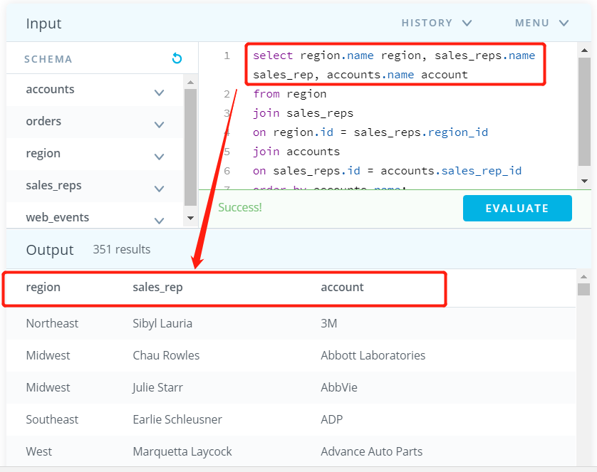
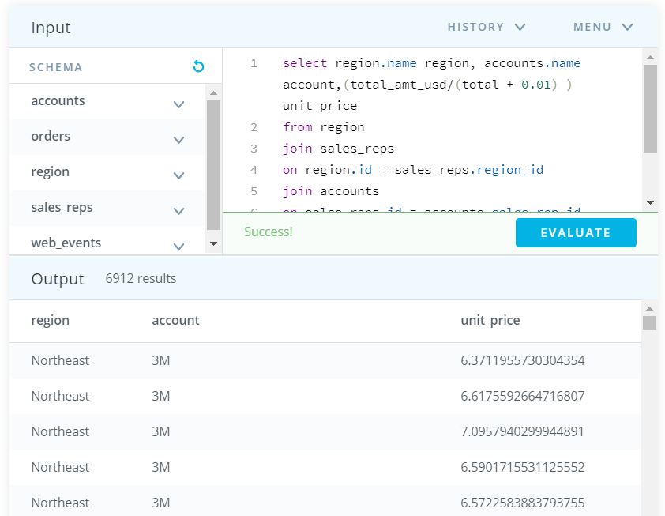

# 练习：JOIN 问题（第一部分）

# 练习

你已经了解了 JOIN，我们接下来通过练习让你熟练掌握这一新的知识点。我在下面提供了 **ERD** 和好几个问题。如果你遇到问题，或想对比检查答案，可以在下一页面找到这些问题的答案！

[](https://classroom.udacity.com/nanodegrees/nd678-cn-1/parts/81cd15b3-bd19-459e-a223-7309e4fc53eb/modules/b47f298e-dc95-4791-8315-12836c86ef31/lessons/8f23fc69-7c88-4a94-97a4-d5f6ef51cf7b/concepts/83da273e-73e7-48b6-a743-219de50b788f#)

建议使用以下环境练习你的查询，并将查询保存到文件中。然后将你的文件与下一页面中我的答案进行对比！

# 问题

1. 为与客户名称 `Walmart` 相关的所有 **web_events** 创建一个表格。表格应该包含三列：`primary_poc`、事件时间和每个事件的`渠道`。此外，你可以选择添加第四列，确保仅选中了 `Walmart` 事件。
2. 为每个 **sales_rep（销售代表）**对应的 **region（区域）**以及相关的 **accounts（客户）**创建一个表格，最终表格应该包含三列：区域 **name（名称）**、销售代表**name（名称）**，以及客户 **name（名称）**。根据客户名称按字母顺序 (A-Z) 排序。
3. 提供每个 **order（订单）**的每个区域 **name（名称）**，以及客户 **name（名称）**和订单的 **unit price（单价）**(total_amt_usd/total)。最终表格应该包含三列：**region name（区域名称）**、**account name（客户名称）**和 **unit price（单价）**。少数几个客户的总订单数为 0，因此我除以的是 (total + 0.01) 以确保没有除以 0。


1.为与客户名称 `Walmart` 相关的所有 **web_events** 创建一个表格。表格应该包含三列：`primary_poc`、事件时间和每个事件的`渠道`。此外，你可以选择添加第四列，确保仅选中了 `Walmart` 事件。

```sql
select primary_poc,occurred_at,channel
from web_events
join accounts
on accounts.id = web_events.account_id

select primary_poc,occurred_at,channel,name
from web_events
join accounts
on accounts.id = web_events.account_id
where name in ('Walmart')
```


```sql

select region.name region, sales_reps.name sales_rep, accounts.name account
from region
join sales_reps
on region.id = sales_reps.region_id
join accounts
on sales_reps.id = accounts.sales_rep_id
order by accounts.name;
```




3.提供每个 **order（订单）**的每个区域 **name（名称）**，以及客户 **name（名称）**和订单的 **unit price（单价）**(total_amt_usd/total)。最终表格应该包含三列：**region name（区域名称）**、**account name（客户名称）**和 **unit price（单价）**。少数几个客户的总订单数为 0，因此我除以的是 (total + 0.01) 以确保没有除以 0。

```sql
select region.name region, accounts.name account,(total_amt_usd/(total + 0.01) ) unit_price
from region
join sales_reps
on region.id = sales_reps.region_id
join accounts
on sales_reps.id = accounts.sales_rep_id
join orders
on orders.account_id = accounts.id
order by accounts.name;
```





### 习题 1/2

标出以下所有正确的表述。

- [x] **ON** 语句应该始终让外键等于主键。
- [ ] **SQL** **要求** **ON** 语句始终让外键等于主键。
- [x] **JOIN** 语句使我们能够从 **SQL** 数据库中的多个表格里获取数据。
- [x] 你可以将第一节课学到的所有命令与 **JOIN** 语句一起使用。
- [ ] 从多个表格中获取数据的唯一方式是使用 **JOIN** 语句。


### 习题 2/2

选择以下所有表述正确的语句。

- [ ] 如果我们想要为表格设定别名，则**必须**在查询中使用 **AS**。
- [ ] 如果我们想要为列设定别名，则**必须**在查询中使用 **AS**。
- [x] 当我们开始连接多个表格时，别名可以用来缩短表格名称，并且很常用。

 我们可以直接在列名称（在 **SELECT** 中）或表格名称（在 **FROM** 或 **JOIN** 中）后面写上别名，方法是在要设定别名的列或表格后面直接写上别名。这样可以创建清晰的列名称，虽然计算是用来创建列的，通过使用表格名称别名，代码更高效。’ 

# 解决方案

1. 为与客户名称 `Walmart` 相关的所有 **web_events** 创建一个表格。表格应该包含三列：`primary_poc`、事件时间和每个事件的`渠道`。此外，你可以选择添加第四列，确保仅选中了 `Walmart` 事件。

```sql
SELECT a.primary_poc, w.occurred_at, w.channel, a.name
FROM web_events w
JOIN accounts a
ON w.account_id = a.id
WHERE a.name = 'Walmart';
```

1. 为每个**销售代表**对应的**区域**以及相关的**客户**创建一个表格，最终表格应该包含三列：区域**名称**、销售代表**名称**，以及客户**名称**。根据客户名称按字母顺序 (A-Z) 排序。 

```sql
SELECT r.name region, s.name rep, a.name account
FROM sales_reps s
JOIN region r
ON s.region_id = r.id
JOIN accounts a
ON a.sales_rep_id = s.id
ORDER BY a.name;
```

1. 提供每个**订单**的每个区域**名称**，以及客户**名称**和订单的**单价** (total_amt_usd/total)。最终表格应该包含三列：**区域名称**、**客户名称**和**单价**。少数几个客户的总订单数为 0，因此我除以的是 (total + 0.01) 以确保没有除以 0。 

```sql
SELECT r.name region, a.name account,
o.total_amt_usd/(o.total + 0.01) unit_price
FROM region r
JOIN sales_reps s
ON s.region_id = r.id
JOIN accounts a
ON a.sales_rep_id = s.id
JOIN orders o
ON o.account_id = a.id;
```

