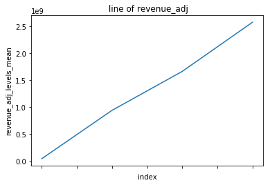

# 项目：TMDb电影数据探索分析

## 目录
<ul>
<li><a href="#intro">简介</a></li>
<li><a href="#wrangling">数据整理</a></li>
<li><a href="#eda">探索性数据分析</a></li>
<li><a href="#conclusions">结论</a></li>
</ul>

<a id='intro'></a>
## 简介


>本数据集中包含 1 万条电影信息，信息来源为“电影数据库”（TMDb，The Movie Database），包括用户评分和票房。总共有10866个样本，有21个特征的数据。21个特征的含义在以下的表格中有列出。本文主要探讨四个问题：
- 每年最受欢迎的电影类别是哪些？
- 票房高的电影有哪些特点？
- 这些年电影票房的变化趋势是什么样的？
- 电影时长有什么特点？


```python
# 用这个框对你计划使用的所有数据包进行设置
#   导入语句。
import numpy as np
import pandas as pd
import matplotlib.pyplot as plt
% matplotlib inline
import seaborn as sns
# 务必包含一个‘magic word’（带有“%”的***），以便将你的视图
#   与 notebook 保持一致。关于更多信息，请访问该网页：
#   http://ipython.readthedocs.io/en/stable/interactive/magics.html

```

<a id='wrangling'></a>
## 数据整理


### 常规属性


```python
# 加载数据并打印几行。进行这几项操作，来检查数据
#   类型，以及是否有缺失数据或错误数据的情况。
df = pd.read_csv('tmdb-movies.csv')
df.head()
```


<div>
<style scoped>
    .dataframe tbody tr th:only-of-type {
        vertical-align: middle;
    }

    .dataframe tbody tr th {
        vertical-align: top;
    }

    .dataframe thead th {
        text-align: right;
    }
</style>
<table border="1" class="dataframe">
  <thead>
    <tr style="text-align: right;">
      <th></th>
      <th>id</th>
      <th>imdb_id</th>
      <th>popularity</th>
      <th>budget</th>
      <th>revenue</th>
      <th>original_title</th>
      <th>cast</th>
      <th>homepage</th>
      <th>director</th>
      <th>tagline</th>
      <th>...</th>
      <th>overview</th>
      <th>runtime</th>
      <th>genres</th>
      <th>production_companies</th>
      <th>release_date</th>
      <th>vote_count</th>
      <th>vote_average</th>
      <th>release_year</th>
      <th>budget_adj</th>
      <th>revenue_adj</th>
    </tr>
  </thead>
  <tbody>
    <tr>
      <th>0</th>
      <td>135397</td>
      <td>tt0369610</td>
      <td>32.985763</td>
      <td>150000000</td>
      <td>1513528810</td>
      <td>Jurassic World</td>
      <td>Chris Pratt|Bryce Dallas Howard|Irrfan Khan|Vi...</td>
      <td>http://www.jurassicworld.com/</td>
      <td>Colin Trevorrow</td>
      <td>The park is open.</td>
      <td>...</td>
      <td>Twenty-two years after the events of Jurassic ...</td>
      <td>124</td>
      <td>Action|Adventure|Science Fiction|Thriller</td>
      <td>Universal Studios|Amblin Entertainment|Legenda...</td>
      <td>6/9/15</td>
      <td>5562</td>
      <td>6.5</td>
      <td>2015</td>
      <td>1.379999e+08</td>
      <td>1.392446e+09</td>
    </tr>
    <tr>
      <th>1</th>
      <td>76341</td>
      <td>tt1392190</td>
      <td>28.419936</td>
      <td>150000000</td>
      <td>378436354</td>
      <td>Mad Max: Fury Road</td>
      <td>Tom Hardy|Charlize Theron|Hugh Keays-Byrne|Nic...</td>
      <td>http://www.madmaxmovie.com/</td>
      <td>George Miller</td>
      <td>What a Lovely Day.</td>
      <td>...</td>
      <td>An apocalyptic story set in the furthest reach...</td>
      <td>120</td>
      <td>Action|Adventure|Science Fiction|Thriller</td>
      <td>Village Roadshow Pictures|Kennedy Miller Produ...</td>
      <td>5/13/15</td>
      <td>6185</td>
      <td>7.1</td>
      <td>2015</td>
      <td>1.379999e+08</td>
      <td>3.481613e+08</td>
    </tr>
    <tr>
      <th>2</th>
      <td>262500</td>
      <td>tt2908446</td>
      <td>13.112507</td>
      <td>110000000</td>
      <td>295238201</td>
      <td>Insurgent</td>
      <td>Shailene Woodley|Theo James|Kate Winslet|Ansel...</td>
      <td>http://www.thedivergentseries.movie/#insurgent</td>
      <td>Robert Schwentke</td>
      <td>One Choice Can Destroy You</td>
      <td>...</td>
      <td>Beatrice Prior must confront her inner demons ...</td>
      <td>119</td>
      <td>Adventure|Science Fiction|Thriller</td>
      <td>Summit Entertainment|Mandeville Films|Red Wago...</td>
      <td>3/18/15</td>
      <td>2480</td>
      <td>6.3</td>
      <td>2015</td>
      <td>1.012000e+08</td>
      <td>2.716190e+08</td>
    </tr>
    <tr>
      <th>3</th>
      <td>140607</td>
      <td>tt2488496</td>
      <td>11.173104</td>
      <td>200000000</td>
      <td>2068178225</td>
      <td>Star Wars: The Force Awakens</td>
      <td>Harrison Ford|Mark Hamill|Carrie Fisher|Adam D...</td>
      <td>http://www.starwars.com/films/star-wars-episod...</td>
      <td>J.J. Abrams</td>
      <td>Every generation has a story.</td>
      <td>...</td>
      <td>Thirty years after defeating the Galactic Empi...</td>
      <td>136</td>
      <td>Action|Adventure|Science Fiction|Fantasy</td>
      <td>Lucasfilm|Truenorth Productions|Bad Robot</td>
      <td>12/15/15</td>
      <td>5292</td>
      <td>7.5</td>
      <td>2015</td>
      <td>1.839999e+08</td>
      <td>1.902723e+09</td>
    </tr>
    <tr>
      <th>4</th>
      <td>168259</td>
      <td>tt2820852</td>
      <td>9.335014</td>
      <td>190000000</td>
      <td>1506249360</td>
      <td>Furious 7</td>
      <td>Vin Diesel|Paul Walker|Jason Statham|Michelle ...</td>
      <td>http://www.furious7.com/</td>
      <td>James Wan</td>
      <td>Vengeance Hits Home</td>
      <td>...</td>
      <td>Deckard Shaw seeks revenge against Dominic Tor...</td>
      <td>137</td>
      <td>Action|Crime|Thriller</td>
      <td>Universal Pictures|Original Film|Media Rights ...</td>
      <td>4/1/15</td>
      <td>2947</td>
      <td>7.3</td>
      <td>2015</td>
      <td>1.747999e+08</td>
      <td>1.385749e+09</td>
    </tr>
  </tbody>
</table>
<p>5 rows × 21 columns</p>
</div>


通过前面几行的数据，对数据集记录的数据有一个大概的了解，下面检查一下数据集的具体数据类型


```python
#首先，可以通过info方法，获取数据集的基本信息,该方法可以简要描述数据各列的类型，非缺失的字段数目
df.info()
```

    <class 'pandas.core.frame.DataFrame'>
    RangeIndex: 10866 entries, 0 to 10865
    Data columns (total 21 columns):
    id                      10866 non-null int64
    imdb_id                 10856 non-null object
    popularity              10866 non-null float64
    budget                  10866 non-null int64
    revenue                 10866 non-null int64
    original_title          10866 non-null object
    cast                    10790 non-null object
    homepage                2936 non-null object
    director                10822 non-null object
    tagline                 8042 non-null object
    keywords                9373 non-null object
    overview                10862 non-null object
    runtime                 10866 non-null int64
    genres                  10843 non-null object
    production_companies    9836 non-null object
    release_date            10866 non-null object
    vote_count              10866 non-null int64
    vote_average            10866 non-null float64
    release_year            10866 non-null int64
    budget_adj              10866 non-null float64
    revenue_adj             10866 non-null float64
    dtypes: float64(4), int64(6), object(11)
    memory usage: 1.7+ MB
    

| 特征                 | 含义        | 数据类型 |
| -------------------- | ----------- | -------- |
| id                   | 用户id      | 整型     |
| imdb_id              | 数据库id    | 字符型   |
| popularity           | 人气        | 浮点型   |
| budget               | 预算        | 整型     |
| revenue              | 收入        | 整型     |
| original_title       | 原标题      | 字符型   |
| cast                 | 演职人员    | 字符型   |
| homepage             | 主页        | 字符型   |
| director             | 导演        | 字符型   |
| tagline              | 标语        | 字符型   |
| keywords             | 关键字      | 字符型   |
| overview             | 概述        | 字符型   |
| runtime              | 时长        | 整型     |
| genres               | 电影类型    | 字符型   |
| production_companies | 出品公司    | 字符型   |
| release_date         | 上映时间    | 整型     |
| vote_count           | 票数统计    | 整型     |
| vote_average         | 平均票数    | 浮点型   |
| release_year         | 发布年份    | 整型     |
| budget_adj           | 预算adj     | 浮点型   |
| revenue_adj          | 实际收入adj | 浮点型   |

上面的表格我把数据集的列的名字翻译成对应的中文，这样更好理解。通过系统检查发现：该数据集中存在缺失值。


```python
# 也可以通过这个检查每一列的数据类型
df.dtypes
```


    id                        int64
    imdb_id                  object
    popularity              float64
    budget                    int64
    revenue                   int64
    original_title           object
    cast                     object
    homepage                 object
    director                 object
    tagline                  object
    keywords                 object
    overview                 object
    runtime                   int64
    genres                   object
    production_companies     object
    release_date             object
    vote_count                int64
    vote_average            float64
    release_year              int64
    budget_adj              float64
    revenue_adj             float64
    dtype: object


```python
df.isnull().sum()
```


    id                         0
    imdb_id                   10
    popularity                 0
    budget                     0
    revenue                    0
    original_title             0
    cast                      76
    homepage                7930
    director                  44
    tagline                 2824
    keywords                1493
    overview                   4
    runtime                    0
    genres                    23
    production_companies    1030
    release_date               0
    vote_count                 0
    vote_average               0
    release_year               0
    budget_adj                 0
    revenue_adj                0
    dtype: int64


```python
#这是对数据集的数值类型的描述性统计
describe_numeric = df.describe()
describe_numeric
```


<div>
<style scoped>
    .dataframe tbody tr th:only-of-type {
        vertical-align: middle;
    }

    .dataframe tbody tr th {
        vertical-align: top;
    }

    .dataframe thead th {
        text-align: right;
    }
</style>
<table border="1" class="dataframe">
  <thead>
    <tr style="text-align: right;">
      <th></th>
      <th>id</th>
      <th>popularity</th>
      <th>budget</th>
      <th>revenue</th>
      <th>runtime</th>
      <th>vote_count</th>
      <th>vote_average</th>
      <th>release_year</th>
      <th>budget_adj</th>
      <th>revenue_adj</th>
    </tr>
  </thead>
  <tbody>
    <tr>
      <th>count</th>
      <td>10866.000000</td>
      <td>10866.000000</td>
      <td>1.086600e+04</td>
      <td>1.086600e+04</td>
      <td>10866.000000</td>
      <td>10866.000000</td>
      <td>10866.000000</td>
      <td>10866.000000</td>
      <td>1.086600e+04</td>
      <td>1.086600e+04</td>
    </tr>
    <tr>
      <th>mean</th>
      <td>66064.177434</td>
      <td>0.646441</td>
      <td>1.462570e+07</td>
      <td>3.982332e+07</td>
      <td>102.070863</td>
      <td>217.389748</td>
      <td>5.974922</td>
      <td>2001.322658</td>
      <td>1.755104e+07</td>
      <td>5.136436e+07</td>
    </tr>
    <tr>
      <th>std</th>
      <td>92130.136561</td>
      <td>1.000185</td>
      <td>3.091321e+07</td>
      <td>1.170035e+08</td>
      <td>31.381405</td>
      <td>575.619058</td>
      <td>0.935142</td>
      <td>12.812941</td>
      <td>3.430616e+07</td>
      <td>1.446325e+08</td>
    </tr>
    <tr>
      <th>min</th>
      <td>5.000000</td>
      <td>0.000065</td>
      <td>0.000000e+00</td>
      <td>0.000000e+00</td>
      <td>0.000000</td>
      <td>10.000000</td>
      <td>1.500000</td>
      <td>1960.000000</td>
      <td>0.000000e+00</td>
      <td>0.000000e+00</td>
    </tr>
    <tr>
      <th>25%</th>
      <td>10596.250000</td>
      <td>0.207583</td>
      <td>0.000000e+00</td>
      <td>0.000000e+00</td>
      <td>90.000000</td>
      <td>17.000000</td>
      <td>5.400000</td>
      <td>1995.000000</td>
      <td>0.000000e+00</td>
      <td>0.000000e+00</td>
    </tr>
    <tr>
      <th>50%</th>
      <td>20669.000000</td>
      <td>0.383856</td>
      <td>0.000000e+00</td>
      <td>0.000000e+00</td>
      <td>99.000000</td>
      <td>38.000000</td>
      <td>6.000000</td>
      <td>2006.000000</td>
      <td>0.000000e+00</td>
      <td>0.000000e+00</td>
    </tr>
    <tr>
      <th>75%</th>
      <td>75610.000000</td>
      <td>0.713817</td>
      <td>1.500000e+07</td>
      <td>2.400000e+07</td>
      <td>111.000000</td>
      <td>145.750000</td>
      <td>6.600000</td>
      <td>2011.000000</td>
      <td>2.085325e+07</td>
      <td>3.369710e+07</td>
    </tr>
    <tr>
      <th>max</th>
      <td>417859.000000</td>
      <td>32.985763</td>
      <td>4.250000e+08</td>
      <td>2.781506e+09</td>
      <td>900.000000</td>
      <td>9767.000000</td>
      <td>9.200000</td>
      <td>2015.000000</td>
      <td>4.250000e+08</td>
      <td>2.827124e+09</td>
    </tr>
  </tbody>
</table>
</div>


**通过分析描述性数字特征，我们发现数据集中的电影信息，发布的年份是从1960年到2015年的，总共56年的电影。**


```python
df.columns
```


    Index(['id', 'imdb_id', 'popularity', 'budget', 'revenue', 'original_title',
           'cast', 'homepage', 'director', 'tagline', 'keywords', 'overview',
           'runtime', 'genres', 'production_companies', 'release_date',
           'vote_count', 'vote_average', 'release_year', 'budget_adj',
           'revenue_adj'],
          dtype='object')


```python
#这是对资费类型的描述性统计
describe_object = df.describe(include=[np.object])
describe_object
```


<div>
<style scoped>
    .dataframe tbody tr th:only-of-type {
        vertical-align: middle;
    }

    .dataframe tbody tr th {
        vertical-align: top;
    }

    .dataframe thead th {
        text-align: right;
    }
</style>
<table border="1" class="dataframe">
  <thead>
    <tr style="text-align: right;">
      <th></th>
      <th>imdb_id</th>
      <th>original_title</th>
      <th>cast</th>
      <th>homepage</th>
      <th>director</th>
      <th>tagline</th>
      <th>keywords</th>
      <th>overview</th>
      <th>genres</th>
      <th>production_companies</th>
      <th>release_date</th>
    </tr>
  </thead>
  <tbody>
    <tr>
      <th>count</th>
      <td>10856</td>
      <td>10866</td>
      <td>10790</td>
      <td>2936</td>
      <td>10822</td>
      <td>8042</td>
      <td>9373</td>
      <td>10862</td>
      <td>10843</td>
      <td>9836</td>
      <td>10866</td>
    </tr>
    <tr>
      <th>unique</th>
      <td>10855</td>
      <td>10571</td>
      <td>10719</td>
      <td>2896</td>
      <td>5067</td>
      <td>7997</td>
      <td>8804</td>
      <td>10847</td>
      <td>2039</td>
      <td>7445</td>
      <td>5909</td>
    </tr>
    <tr>
      <th>top</th>
      <td>tt0411951</td>
      <td>Hamlet</td>
      <td>Louis C.K.</td>
      <td>http://www.missionimpossible.com/</td>
      <td>Woody Allen</td>
      <td>Based on a true story.</td>
      <td>woman director</td>
      <td>No overview found.</td>
      <td>Comedy</td>
      <td>Paramount Pictures</td>
      <td>1/1/09</td>
    </tr>
    <tr>
      <th>freq</th>
      <td>2</td>
      <td>4</td>
      <td>6</td>
      <td>4</td>
      <td>45</td>
      <td>5</td>
      <td>134</td>
      <td>13</td>
      <td>712</td>
      <td>156</td>
      <td>28</td>
    </tr>
  </tbody>
</table>
</div>


**对字符型数据的描述性统计，
我们也了解到数据集的一些信息
11个属性是字符型，电影类型的这一列，有10843个样本，说明可能存在缺失值；2039个唯一值，最多的电影类型是Drama，总共出现712次**


```python
#查看每一个变量是否存在缺失值以及缺失值的数量的描述性统计
df.isnull().describe()
```


<div>
<style scoped>
    .dataframe tbody tr th:only-of-type {
        vertical-align: middle;
    }

    .dataframe tbody tr th {
        vertical-align: top;
    }

    .dataframe thead th {
        text-align: right;
    }
</style>
<table border="1" class="dataframe">
  <thead>
    <tr style="text-align: right;">
      <th></th>
      <th>id</th>
      <th>imdb_id</th>
      <th>popularity</th>
      <th>budget</th>
      <th>revenue</th>
      <th>original_title</th>
      <th>cast</th>
      <th>homepage</th>
      <th>director</th>
      <th>tagline</th>
      <th>...</th>
      <th>overview</th>
      <th>runtime</th>
      <th>genres</th>
      <th>production_companies</th>
      <th>release_date</th>
      <th>vote_count</th>
      <th>vote_average</th>
      <th>release_year</th>
      <th>budget_adj</th>
      <th>revenue_adj</th>
    </tr>
  </thead>
  <tbody>
    <tr>
      <th>count</th>
      <td>10866</td>
      <td>10866</td>
      <td>10866</td>
      <td>10866</td>
      <td>10866</td>
      <td>10866</td>
      <td>10866</td>
      <td>10866</td>
      <td>10866</td>
      <td>10866</td>
      <td>...</td>
      <td>10866</td>
      <td>10866</td>
      <td>10866</td>
      <td>10866</td>
      <td>10866</td>
      <td>10866</td>
      <td>10866</td>
      <td>10866</td>
      <td>10866</td>
      <td>10866</td>
    </tr>
    <tr>
      <th>unique</th>
      <td>1</td>
      <td>2</td>
      <td>1</td>
      <td>1</td>
      <td>1</td>
      <td>1</td>
      <td>2</td>
      <td>2</td>
      <td>2</td>
      <td>2</td>
      <td>...</td>
      <td>2</td>
      <td>1</td>
      <td>2</td>
      <td>2</td>
      <td>1</td>
      <td>1</td>
      <td>1</td>
      <td>1</td>
      <td>1</td>
      <td>1</td>
    </tr>
    <tr>
      <th>top</th>
      <td>False</td>
      <td>False</td>
      <td>False</td>
      <td>False</td>
      <td>False</td>
      <td>False</td>
      <td>False</td>
      <td>True</td>
      <td>False</td>
      <td>False</td>
      <td>...</td>
      <td>False</td>
      <td>False</td>
      <td>False</td>
      <td>False</td>
      <td>False</td>
      <td>False</td>
      <td>False</td>
      <td>False</td>
      <td>False</td>
      <td>False</td>
    </tr>
    <tr>
      <th>freq</th>
      <td>10866</td>
      <td>10856</td>
      <td>10866</td>
      <td>10866</td>
      <td>10866</td>
      <td>10866</td>
      <td>10790</td>
      <td>7930</td>
      <td>10822</td>
      <td>8042</td>
      <td>...</td>
      <td>10862</td>
      <td>10866</td>
      <td>10843</td>
      <td>9836</td>
      <td>10866</td>
      <td>10866</td>
      <td>10866</td>
      <td>10866</td>
      <td>10866</td>
      <td>10866</td>
    </tr>
  </tbody>
</table>
<p>4 rows × 21 columns</p>
</div>


**通过观察我们发现：描述性统计表格有如下特点：**
- unique的类型有两种，一种是1，另一种是2
- 有两列较多的的，homepage 的缺失值为7930个，tagline的缺失值为8042个
- 每一列有两个唯一值类型的，说明是有缺失值。这两种值：一种是记录的数据，而另一种应该是缺失值，我们可以通过抽样查看具体的数据。


```python
#抽取原始数据的几个样本来观察
df.sample(10)
```


<div>
<style scoped>
    .dataframe tbody tr th:only-of-type {
        vertical-align: middle;
    }

    .dataframe tbody tr th {
        vertical-align: top;
    }

    .dataframe thead th {
        text-align: right;
    }
</style>
<table border="1" class="dataframe">
  <thead>
    <tr style="text-align: right;">
      <th></th>
      <th>id</th>
      <th>imdb_id</th>
      <th>popularity</th>
      <th>budget</th>
      <th>revenue</th>
      <th>original_title</th>
      <th>cast</th>
      <th>homepage</th>
      <th>director</th>
      <th>tagline</th>
      <th>...</th>
      <th>overview</th>
      <th>runtime</th>
      <th>genres</th>
      <th>production_companies</th>
      <th>release_date</th>
      <th>vote_count</th>
      <th>vote_average</th>
      <th>release_year</th>
      <th>budget_adj</th>
      <th>revenue_adj</th>
    </tr>
  </thead>
  <tbody>
    <tr>
      <th>3339</th>
      <td>13180</td>
      <td>tt1332128</td>
      <td>0.067761</td>
      <td>0</td>
      <td>0</td>
      <td>Zeitgeist: Addendum</td>
      <td>NaN</td>
      <td>http://www.zeitgeistmovie.com</td>
      <td>Peter Joseph</td>
      <td>NaN</td>
      <td>...</td>
      <td>Zeitgeist: Addendum premiered at the 5th Annua...</td>
      <td>123</td>
      <td>Documentary|History|War</td>
      <td>Gentle Machine Productions LLC</td>
      <td>10/2/08</td>
      <td>44</td>
      <td>7.0</td>
      <td>2008</td>
      <td>0.000000e+00</td>
      <td>0.000000e+00</td>
    </tr>
    <tr>
      <th>2484</th>
      <td>17707</td>
      <td>tt0120620</td>
      <td>0.566661</td>
      <td>25000000</td>
      <td>13000000</td>
      <td>Brokedown Palace</td>
      <td>Claire Danes|Kate Beckinsale|Bill Pullman|Jacq...</td>
      <td>NaN</td>
      <td>Jonathan Kaplan</td>
      <td>Their graduation present was a trip to paradis...</td>
      <td>...</td>
      <td>Best friends Alice and Darlene take a trip to ...</td>
      <td>100</td>
      <td>Drama|Thriller</td>
      <td>Twentieth Century Fox Film Corporation|Fox 200...</td>
      <td>8/13/99</td>
      <td>52</td>
      <td>6.3</td>
      <td>1999</td>
      <td>3.272632e+07</td>
      <td>1.701769e+07</td>
    </tr>
    <tr>
      <th>6177</th>
      <td>11018</td>
      <td>tt0090350</td>
      <td>0.204990</td>
      <td>24000000</td>
      <td>0</td>
      <td>Year of the Dragon</td>
      <td>Mickey Rourke|John Lone|Ariane|Leonard Termo|R...</td>
      <td>NaN</td>
      <td>Michael Cimino</td>
      <td>It isn't the Bronx or Brooklyn, it isn't even ...</td>
      <td>...</td>
      <td>In New York, racist Capt. Stanley White become...</td>
      <td>134</td>
      <td>Action|Crime|Drama|Thriller</td>
      <td>Dino de Laurentiis Cinematografica</td>
      <td>8/16/85</td>
      <td>29</td>
      <td>6.4</td>
      <td>1985</td>
      <td>4.865199e+07</td>
      <td>0.000000e+00</td>
    </tr>
    <tr>
      <th>9218</th>
      <td>10283</td>
      <td>tt0097388</td>
      <td>0.498792</td>
      <td>5000000</td>
      <td>14000000</td>
      <td>Friday the 13th Part VIII: Jason Takes Manhattan</td>
      <td>Kane Hodder|Jensen Daggett|Scott Reeves|Barbar...</td>
      <td>NaN</td>
      <td>Rob Hedden</td>
      <td>The Big Apple's in BIG trouble!</td>
      <td>...</td>
      <td>The Big Apple's in big trouble, as indestructi...</td>
      <td>100</td>
      <td>Horror|Thriller</td>
      <td>Paramount Pictures|Sean S. Cunningham Films|Ho...</td>
      <td>7/28/89</td>
      <td>85</td>
      <td>4.7</td>
      <td>1989</td>
      <td>8.794925e+06</td>
      <td>2.462579e+07</td>
    </tr>
    <tr>
      <th>5574</th>
      <td>179826</td>
      <td>tt1767354</td>
      <td>0.805517</td>
      <td>27000000</td>
      <td>0</td>
      <td>Odd Thomas</td>
      <td>Anton Yelchin|Willem Dafoe|Nico Tortorella|Add...</td>
      <td>NaN</td>
      <td>Stephen Sommers</td>
      <td>I might see dead people... But then, by God, I...</td>
      <td>...</td>
      <td>In a California desert town, a short-order coo...</td>
      <td>100</td>
      <td>Mystery|Thriller</td>
      <td>Future Films|Fusion Films|Sommers Company, The</td>
      <td>4/16/13</td>
      <td>201</td>
      <td>6.6</td>
      <td>2013</td>
      <td>2.527290e+07</td>
      <td>0.000000e+00</td>
    </tr>
    <tr>
      <th>8935</th>
      <td>12614</td>
      <td>tt0084865</td>
      <td>0.250551</td>
      <td>0</td>
      <td>28215453</td>
      <td>Victor/Victoria</td>
      <td>Julie Andrews|James Garner|Robert Preston|Lesl...</td>
      <td>NaN</td>
      <td>Blake Edwards</td>
      <td>The disguise surprise comedy of the year!</td>
      <td>...</td>
      <td>A struggling female soprano finds work playing...</td>
      <td>132</td>
      <td>Comedy|Music|Romance</td>
      <td>Metro-Goldwyn-Mayer (MGM)|Artista Management|P...</td>
      <td>4/25/82</td>
      <td>39</td>
      <td>6.5</td>
      <td>1982</td>
      <td>0.000000e+00</td>
      <td>6.375683e+07</td>
    </tr>
    <tr>
      <th>6179</th>
      <td>11338</td>
      <td>tt0089346</td>
      <td>0.132713</td>
      <td>114</td>
      <td>6700000</td>
      <td>Into the Night</td>
      <td>Jeff Goldblum|Michelle Pfeiffer|Stacey Pickren...</td>
      <td>NaN</td>
      <td>John Landis</td>
      <td>A dangerous romance</td>
      <td>...</td>
      <td>Ed Okin used to have a boring life. He used to...</td>
      <td>115</td>
      <td>Comedy|Drama|Thriller</td>
      <td>Universal Pictures</td>
      <td>2/15/85</td>
      <td>24</td>
      <td>6.1</td>
      <td>1985</td>
      <td>2.310969e+02</td>
      <td>1.358201e+07</td>
    </tr>
    <tr>
      <th>1791</th>
      <td>22135</td>
      <td>tt1127221</td>
      <td>0.206657</td>
      <td>0</td>
      <td>0</td>
      <td>Not Forgotten</td>
      <td>Simon Baker|Paz Vega|Chloë Grace Moretz|Clair...</td>
      <td>NaN</td>
      <td>Dror Soref</td>
      <td>NaN</td>
      <td>...</td>
      <td>Set in a Tex-Mex border town, Not Forgotten is...</td>
      <td>100</td>
      <td>Crime|Horror|Mystery|Thriller</td>
      <td>Skyline Pictures</td>
      <td>1/1/09</td>
      <td>15</td>
      <td>5.4</td>
      <td>2009</td>
      <td>0.000000e+00</td>
      <td>0.000000e+00</td>
    </tr>
    <tr>
      <th>8854</th>
      <td>101514</td>
      <td>tt0245380</td>
      <td>0.132870</td>
      <td>0</td>
      <td>0</td>
      <td>Quints</td>
      <td>Kimberly J. Brown|Daniel Roebuck</td>
      <td>NaN</td>
      <td>Bill Corcoran</td>
      <td>As if life at 14 isn't twisted enough.</td>
      <td>...</td>
      <td>Jamie Grover (Kimberly J. Brown) is an only ch...</td>
      <td>83</td>
      <td>Drama|Family|Comedy|TV Movie</td>
      <td>Disney Channel</td>
      <td>8/18/00</td>
      <td>11</td>
      <td>5.1</td>
      <td>2000</td>
      <td>0.000000e+00</td>
      <td>0.000000e+00</td>
    </tr>
    <tr>
      <th>682</th>
      <td>218043</td>
      <td>tt2467046</td>
      <td>2.601775</td>
      <td>16000000</td>
      <td>19682924</td>
      <td>Left Behind</td>
      <td>Nicolas Cage|Chad Michael Murray|Lea Thompson|...</td>
      <td>http://www.leftbehindmovie.com/</td>
      <td>Vic Armstrong</td>
      <td>The End Begins</td>
      <td>...</td>
      <td>A small group of survivors are left behind aft...</td>
      <td>110</td>
      <td>Thriller|Action|Science Fiction</td>
      <td>Stoney Lake Entertainment</td>
      <td>10/3/14</td>
      <td>253</td>
      <td>3.8</td>
      <td>2014</td>
      <td>1.473746e+07</td>
      <td>1.812977e+07</td>
    </tr>
  </tbody>
</table>
<p>10 rows × 21 columns</p>
</div>


**观察发现**
- budget列存在零值
- revenue列存在零值
- homepage列存在空值
- tagline列存在空值


### 数据清理（TMDb电影数据）


```python
# 在讨论数据结构和需要解决的任何问题之后，
#   在本部分的第二小部分进行这些清理步骤。
```

- 对缺失值的处理
- 通过如下的代码来抽查一些样本来检查是否真的有空值，填充空值，填充后的描述性统计，再次抽查一下样本，看看空值的处理情况。
- 在下面我们直接使用编程对整个数据集中的空值进行填充，我们使用Dataframe.fillna,具体的用法请参考链接
[pandas.DataFrame.fillna](http://pandas.pydata.org/pandas-docs/stable/generated/pandas.DataFrame.fillna.html)。填充会对字符型的空值进行填充
- 在前面的空值检查中，数值型的没有发现有空值，所以这里我们填充的缺失值应该都是字符型的，所以使用fillna一次性填充是可行正确的


```python
#查看一下有哪些列，方便输入
df.columns
```


    Index(['id', 'imdb_id', 'popularity', 'budget', 'revenue', 'original_title',
           'cast', 'homepage', 'director', 'tagline', 'keywords', 'overview',
           'runtime', 'genres', 'production_companies', 'release_date',
           'vote_count', 'vote_average', 'release_year', 'budget_adj',
           'revenue_adj'],
          dtype='object')


```python
#对缺失值进行填充,应该放在前面一点
df = df.fillna('missing')
```


```python
#检查数据集中的缺失值的情况并进行描述性统计
describe_null_no = df.isnull().describe()
describe_null_no
```


<div>
<style scoped>
    .dataframe tbody tr th:only-of-type {
        vertical-align: middle;
    }

    .dataframe tbody tr th {
        vertical-align: top;
    }

    .dataframe thead th {
        text-align: right;
    }
</style>
<table border="1" class="dataframe">
  <thead>
    <tr style="text-align: right;">
      <th></th>
      <th>id</th>
      <th>imdb_id</th>
      <th>popularity</th>
      <th>budget</th>
      <th>revenue</th>
      <th>original_title</th>
      <th>cast</th>
      <th>homepage</th>
      <th>director</th>
      <th>tagline</th>
      <th>...</th>
      <th>overview</th>
      <th>runtime</th>
      <th>genres</th>
      <th>production_companies</th>
      <th>release_date</th>
      <th>vote_count</th>
      <th>vote_average</th>
      <th>release_year</th>
      <th>budget_adj</th>
      <th>revenue_adj</th>
    </tr>
  </thead>
  <tbody>
    <tr>
      <th>count</th>
      <td>10866</td>
      <td>10866</td>
      <td>10866</td>
      <td>10866</td>
      <td>10866</td>
      <td>10866</td>
      <td>10866</td>
      <td>10866</td>
      <td>10866</td>
      <td>10866</td>
      <td>...</td>
      <td>10866</td>
      <td>10866</td>
      <td>10866</td>
      <td>10866</td>
      <td>10866</td>
      <td>10866</td>
      <td>10866</td>
      <td>10866</td>
      <td>10866</td>
      <td>10866</td>
    </tr>
    <tr>
      <th>unique</th>
      <td>1</td>
      <td>1</td>
      <td>1</td>
      <td>1</td>
      <td>1</td>
      <td>1</td>
      <td>1</td>
      <td>1</td>
      <td>1</td>
      <td>1</td>
      <td>...</td>
      <td>1</td>
      <td>1</td>
      <td>1</td>
      <td>1</td>
      <td>1</td>
      <td>1</td>
      <td>1</td>
      <td>1</td>
      <td>1</td>
      <td>1</td>
    </tr>
    <tr>
      <th>top</th>
      <td>False</td>
      <td>False</td>
      <td>False</td>
      <td>False</td>
      <td>False</td>
      <td>False</td>
      <td>False</td>
      <td>False</td>
      <td>False</td>
      <td>False</td>
      <td>...</td>
      <td>False</td>
      <td>False</td>
      <td>False</td>
      <td>False</td>
      <td>False</td>
      <td>False</td>
      <td>False</td>
      <td>False</td>
      <td>False</td>
      <td>False</td>
    </tr>
    <tr>
      <th>freq</th>
      <td>10866</td>
      <td>10866</td>
      <td>10866</td>
      <td>10866</td>
      <td>10866</td>
      <td>10866</td>
      <td>10866</td>
      <td>10866</td>
      <td>10866</td>
      <td>10866</td>
      <td>...</td>
      <td>10866</td>
      <td>10866</td>
      <td>10866</td>
      <td>10866</td>
      <td>10866</td>
      <td>10866</td>
      <td>10866</td>
      <td>10866</td>
      <td>10866</td>
      <td>10866</td>
    </tr>
  </tbody>
</table>
<p>4 rows × 21 columns</p>
</div>


**从空值的描述性统计表中我们可以推导出如下发现：**
- 所有的列都只有同一种数据类型，也就是有唯一值
- 所有的列都已经没有缺失值，已经被字符串'missing'填充
- 空值应该已经被填充完了


```python
#检查基本信息
df.info()
```

    <class 'pandas.core.frame.DataFrame'>
    RangeIndex: 10866 entries, 0 to 10865
    Data columns (total 21 columns):
    id                      10866 non-null int64
    imdb_id                 10866 non-null object
    popularity              10866 non-null float64
    budget                  10866 non-null int64
    revenue                 10866 non-null int64
    original_title          10866 non-null object
    cast                    10866 non-null object
    homepage                10866 non-null object
    director                10866 non-null object
    tagline                 10866 non-null object
    keywords                10866 non-null object
    overview                10866 non-null object
    runtime                 10866 non-null int64
    genres                  10866 non-null object
    production_companies    10866 non-null object
    release_date            10866 non-null object
    vote_count              10866 non-null int64
    vote_average            10866 non-null float64
    release_year            10866 non-null int64
    budget_adj              10866 non-null float64
    revenue_adj             10866 non-null float64
    dtypes: float64(4), int64(6), object(11)
    memory usage: 1.7+ MB
    

**通过基本信息发现**
- 和之前的基本信息的记录不一样了
- 通过基本信息检查推理，应该没有空值了，得到再次确认


```python
df.sample(10)
```


<div>
<style scoped>
    .dataframe tbody tr th:only-of-type {
        vertical-align: middle;
    }

    .dataframe tbody tr th {
        vertical-align: top;
    }

    .dataframe thead th {
        text-align: right;
    }
</style>
<table border="1" class="dataframe">
  <thead>
    <tr style="text-align: right;">
      <th></th>
      <th>id</th>
      <th>imdb_id</th>
      <th>popularity</th>
      <th>budget</th>
      <th>revenue</th>
      <th>original_title</th>
      <th>cast</th>
      <th>homepage</th>
      <th>director</th>
      <th>tagline</th>
      <th>...</th>
      <th>overview</th>
      <th>runtime</th>
      <th>genres</th>
      <th>production_companies</th>
      <th>release_date</th>
      <th>vote_count</th>
      <th>vote_average</th>
      <th>release_year</th>
      <th>budget_adj</th>
      <th>revenue_adj</th>
    </tr>
  </thead>
  <tbody>
    <tr>
      <th>5386</th>
      <td>9406</td>
      <td>tt0118604</td>
      <td>0.223151</td>
      <td>22000000</td>
      <td>26570463</td>
      <td>An American Werewolf in Paris</td>
      <td>Tom Everett Scott|Julie Delpy|Vince Vieluf|Jul...</td>
      <td>missing</td>
      <td>Anthony Waller</td>
      <td>Things are about to get a little hairy.</td>
      <td>...</td>
      <td>An American man unwittingly gets involved with...</td>
      <td>105</td>
      <td>Horror|Comedy</td>
      <td>Hollywood Pictures|Cometstone Pictures</td>
      <td>12/25/97</td>
      <td>68</td>
      <td>5.3</td>
      <td>1997</td>
      <td>2.988613e+07</td>
      <td>3.609492e+07</td>
    </tr>
    <tr>
      <th>3109</th>
      <td>16000</td>
      <td>tt1037011</td>
      <td>0.390228</td>
      <td>0</td>
      <td>0</td>
      <td>Ben 10: Race Against Time</td>
      <td>Graham Phillips|David Franklin|Lee Majors|Chri...</td>
      <td>missing</td>
      <td>Alex Winter</td>
      <td>What's the point of having the Omnitrix if I c...</td>
      <td>...</td>
      <td>"Ben 10: Race Against Time" has Ben back in hi...</td>
      <td>67</td>
      <td>Action|Family|Science Fiction</td>
      <td>missing</td>
      <td>2/11/08</td>
      <td>14</td>
      <td>3.1</td>
      <td>2008</td>
      <td>0.000000e+00</td>
      <td>0.000000e+00</td>
    </tr>
    <tr>
      <th>9362</th>
      <td>10969</td>
      <td>tt0102227</td>
      <td>0.443127</td>
      <td>0</td>
      <td>0</td>
      <td>Knight Rider 2000</td>
      <td>David Hasselhoff|Edward Mulhare|Susan Norman|C...</td>
      <td>missing</td>
      <td>Alan J. Levi</td>
      <td>missing</td>
      <td>...</td>
      <td>In the future, guns are banned and criminals a...</td>
      <td>91</td>
      <td>Action|Science Fiction</td>
      <td>missing</td>
      <td>5/19/91</td>
      <td>12</td>
      <td>4.6</td>
      <td>1991</td>
      <td>0.000000e+00</td>
      <td>0.000000e+00</td>
    </tr>
    <tr>
      <th>10588</th>
      <td>34223</td>
      <td>tt0092147</td>
      <td>0.076196</td>
      <td>1900000</td>
      <td>4790926</td>
      <td>Vamp</td>
      <td>Chris Makepeace|Sandy Baron|Robert Rusler|Dede...</td>
      <td>missing</td>
      <td>Richard Wenk</td>
      <td>A Frightening Comedy</td>
      <td>...</td>
      <td>Two fraternity pledges go to a sleazy bar look...</td>
      <td>93</td>
      <td>Comedy|Horror</td>
      <td>Balcor Film Investors|Planet Productions</td>
      <td>7/18/86</td>
      <td>12</td>
      <td>5.2</td>
      <td>1986</td>
      <td>3.779872e+06</td>
      <td>9.531099e+06</td>
    </tr>
    <tr>
      <th>2126</th>
      <td>38031</td>
      <td>tt1182350</td>
      <td>0.493121</td>
      <td>22000000</td>
      <td>0</td>
      <td>You Will Meet a Tall Dark Stranger</td>
      <td>Naomi Watts|Josh Brolin|Antonio Banderas|Ewen ...</td>
      <td>missing</td>
      <td>Woody Allen</td>
      <td>missing</td>
      <td>...</td>
      <td>Two married couples find only trouble and hear...</td>
      <td>98</td>
      <td>Comedy|Drama|Romance</td>
      <td>Antena 3 Films</td>
      <td>5/23/10</td>
      <td>131</td>
      <td>5.8</td>
      <td>2010</td>
      <td>2.200000e+07</td>
      <td>0.000000e+00</td>
    </tr>
    <tr>
      <th>4594</th>
      <td>84175</td>
      <td>tt2125435</td>
      <td>0.430256</td>
      <td>1800000</td>
      <td>21107746</td>
      <td>Beasts of the Southern Wild</td>
      <td>Quvenzhané Wallis|Dwight Henry|Levy Easterly|...</td>
      <td>http://www.welcometothebathtub.com</td>
      <td>Benh Zeitlin</td>
      <td>I  gotta take care of mine.</td>
      <td>...</td>
      <td>Hushpuppy, an intrepid six-year-old girl, live...</td>
      <td>93</td>
      <td>Drama|Fantasy</td>
      <td>Journeyman Pictures|Court 13 Pictures|Cinereach</td>
      <td>6/29/12</td>
      <td>262</td>
      <td>6.6</td>
      <td>2012</td>
      <td>1.709540e+06</td>
      <td>2.004696e+07</td>
    </tr>
    <tr>
      <th>9773</th>
      <td>22048</td>
      <td>tt0071517</td>
      <td>0.378621</td>
      <td>500000</td>
      <td>0</td>
      <td>Foxy Brown</td>
      <td>Pam Grier|Antonio Fargas|Peter Brown|Terry Car...</td>
      <td>missing</td>
      <td>Jack Hill</td>
      <td>A chick with drive who don't take no jive!</td>
      <td>...</td>
      <td>A voluptuous black woman takes a job as a high...</td>
      <td>94</td>
      <td>Thriller|Action|Crime</td>
      <td>American International Pictures (AIP)</td>
      <td>4/5/74</td>
      <td>21</td>
      <td>6.0</td>
      <td>1974</td>
      <td>2.211142e+06</td>
      <td>0.000000e+00</td>
    </tr>
    <tr>
      <th>10105</th>
      <td>36843</td>
      <td>tt0100024</td>
      <td>0.070766</td>
      <td>0</td>
      <td>0</td>
      <td>Life is Sweet</td>
      <td>Alison Steadman|Jim Broadbent|Claire Skinner|J...</td>
      <td>missing</td>
      <td>Mike Leigh</td>
      <td>missing</td>
      <td>...</td>
      <td>Just north of London live Wendy, Andy, and the...</td>
      <td>103</td>
      <td>Comedy|Drama</td>
      <td>Film Four International|Thin Man Films</td>
      <td>11/15/90</td>
      <td>17</td>
      <td>6.4</td>
      <td>1990</td>
      <td>0.000000e+00</td>
      <td>0.000000e+00</td>
    </tr>
    <tr>
      <th>4210</th>
      <td>6280</td>
      <td>tt0110216</td>
      <td>0.848554</td>
      <td>60000000</td>
      <td>37000000</td>
      <td>Junior</td>
      <td>Arnold Schwarzenegger|Danny DeVito|Emma Thomps...</td>
      <td>missing</td>
      <td>Ivan Reitman</td>
      <td>Nothing is inconceivable</td>
      <td>...</td>
      <td>As part of a fertility research project, a mal...</td>
      <td>109</td>
      <td>Comedy|Romance|Science Fiction</td>
      <td>Universal Pictures|Northern Lights Entertainment</td>
      <td>11/22/94</td>
      <td>207</td>
      <td>4.7</td>
      <td>1994</td>
      <td>8.826669e+07</td>
      <td>5.443113e+07</td>
    </tr>
    <tr>
      <th>3351</th>
      <td>18635</td>
      <td>tt1104806</td>
      <td>0.033634</td>
      <td>0</td>
      <td>0</td>
      <td>One Week</td>
      <td>Joshua Jackson|Liane Balaban|Campbell Scott|Pe...</td>
      <td>http://www.oneweek.ca</td>
      <td>Michael McGowan</td>
      <td>What Would You Do?</td>
      <td>...</td>
      <td>Ben Tyler (Joshua Jackson) has been diagnosed ...</td>
      <td>94</td>
      <td>Adventure|Drama</td>
      <td>Mulmur Feed Company</td>
      <td>9/8/08</td>
      <td>19</td>
      <td>7.1</td>
      <td>2008</td>
      <td>0.000000e+00</td>
      <td>0.000000e+00</td>
    </tr>
  </tbody>
</table>
<p>10 rows × 21 columns</p>
</div>


- 这时候已经没有缺失值

### 检查重复值
**检查有没有重复值**


```python
#检查重复值
df.duplicated().sum()
```


    1


```python
#删除含有重复值的项
df = df.drop_duplicates()
```


```python
#再次检查重复值的数量，应该为零
df.duplicated().sum()
```


    0


```python
#对电影类型进行整理
genres = df['genres']
```


```python
df.columns
```


    Index(['id', 'imdb_id', 'popularity', 'budget', 'revenue', 'original_title',
           'cast', 'homepage', 'director', 'tagline', 'keywords', 'overview',
           'runtime', 'genres', 'production_companies', 'release_date',
           'vote_count', 'vote_average', 'release_year', 'budget_adj',
           'revenue_adj'],
          dtype='object')


#### 对电影类型进行整理
- 观察电影类型这一列的数据特点
- 电影类型这一列的数据中，每个数据有|分割多个类型
- 我们队电影类型进行分隔处理


```python
#初始的电影类型记录特点是这样的
genres = df.genres
genres.head()
```


    0    Action|Adventure|Science Fiction|Thriller
    1    Action|Adventure|Science Fiction|Thriller
    2           Adventure|Science Fiction|Thriller
    3     Action|Adventure|Science Fiction|Fantasy
    4                        Action|Crime|Thriller
    Name: genres, dtype: object


```python
#抽样检查10个样本看看其他地方电影类型记录特点
genres.sample(10)
```


    3186                          Comedy|Drama
    3594                              Thriller
    297                        Thriller|Horror
    3792                      Adventure|Family
    5407                 Action|Comedy|Romance
    9828     Adventure|Fantasy|Science Fiction
    2502                Drama|History|Thriller
    1783         Action|Crime|Mystery|Thriller
    10677       Action|Adventure|Drama|Western
    10001                       Romance|Comedy
    Name: genres, dtype: object


**我们发现每一步电影具有多个电影类型被竖线分隔，接下来我们需要对电影类型进行如下处理**
- 讲电影类型重新分割，建立新的一列记录
- 合并到数据集


```python
genres = df['genres'].str.split('|',expand = True).stack().reset_index(level = 1,drop = True).rename('genres2')
```


```python
genres.head(5)
```


    0             Action
    0          Adventure
    0    Science Fiction
    0           Thriller
    1             Action
    Name: genres2, dtype: object


```python
#检查genres的唯一值
genres.unique()
```


    array(['Action', 'Adventure', 'Science Fiction', 'Thriller', 'Fantasy',
           'Crime', 'Western', 'Drama', 'Family', 'Animation', 'Comedy',
           'Mystery', 'Romance', 'War', 'History', 'Music', 'Horror',
           'Documentary', 'TV Movie', 'missing', 'Foreign'], dtype=object)


```python
#检查genres的描述性统计
genres.describe()
```


    count     26978
    unique       21
    top       Drama
    freq       4760
    Name: genres2, dtype: object


**现在电影类型明显更少了，只有21类**


```python
#合并这一新的电影分组到数据集中
new_df = df.join(genres)
```


```python
#检查确认连接情况
new_df[['genres','genres2','id']].head(5)
```


<div>
<style scoped>
    .dataframe tbody tr th:only-of-type {
        vertical-align: middle;
    }

    .dataframe tbody tr th {
        vertical-align: top;
    }

    .dataframe thead th {
        text-align: right;
    }
</style>
<table border="1" class="dataframe">
  <thead>
    <tr style="text-align: right;">
      <th></th>
      <th>genres</th>
      <th>genres2</th>
      <th>id</th>
    </tr>
  </thead>
  <tbody>
    <tr>
      <th>0</th>
      <td>Action|Adventure|Science Fiction|Thriller</td>
      <td>Action</td>
      <td>135397</td>
    </tr>
    <tr>
      <th>0</th>
      <td>Action|Adventure|Science Fiction|Thriller</td>
      <td>Adventure</td>
      <td>135397</td>
    </tr>
    <tr>
      <th>0</th>
      <td>Action|Adventure|Science Fiction|Thriller</td>
      <td>Science Fiction</td>
      <td>135397</td>
    </tr>
    <tr>
      <th>0</th>
      <td>Action|Adventure|Science Fiction|Thriller</td>
      <td>Thriller</td>
      <td>135397</td>
    </tr>
    <tr>
      <th>1</th>
      <td>Action|Adventure|Science Fiction|Thriller</td>
      <td>Action</td>
      <td>76341</td>
    </tr>
  </tbody>
</table>
</div>


```python
#检查数据集new_df的列情况
new_df.columns
```


    Index(['id', 'imdb_id', 'popularity', 'budget', 'revenue', 'original_title',
           'cast', 'homepage', 'director', 'tagline', 'keywords', 'overview',
           'runtime', 'genres', 'production_companies', 'release_date',
           'vote_count', 'vote_average', 'release_year', 'budget_adj',
           'revenue_adj', 'genres2'],
          dtype='object')


**图形说明：**
- 图为每种整理后的电影类型对应的票房收入的排序的直方图
- 从图中可以看出从左至右每种电影类型的票房收入对比

### 到这里，数据清洗的工作已经完成，现在数据应该是干净整洁的数据


<a id='eda'></a>
## 探索性数据分析


### 研究问题 1（每年最受欢迎的电影类型是哪些？ ）


```python
# 用这个代码框和其它代码框探索数据。请务必记得添加
#   Markdown 框，以便记录你的观察和调查结果。

```


```python
#根据分组genres2，统计出popularity的每个电影类型的平均
new_df_genres2 = new_df.groupby('genres2')['popularity'].mean().sort_values(ascending=False)
```


```python
#可视化genres2的平均popularity
new_df_genres2.plot(kind='bar',figsize=(15,15))
```


    <matplotlib.axes._subplots.AxesSubplot at 0xc7abf0b8>


**图形说明：**
- 图为每种整理后的电影类型对应的人气的排序的直方图
- 从图中可以看出从左至右每种电影类型的人气对比


```python
#选择人气popularity当做评估指标，对每年最受欢迎电影进行评估
popularity = new_df.groupby(['genres2'],as_index=False)['popularity'].mean()
```


```python
popularity.head()
```


<div>
<style scoped>
    .dataframe tbody tr th:only-of-type {
        vertical-align: middle;
    }

    .dataframe tbody tr th {
        vertical-align: top;
    }

    .dataframe thead th {
        text-align: right;
    }
</style>
<table border="1" class="dataframe">
  <thead>
    <tr style="text-align: right;">
      <th></th>
      <th>genres2</th>
      <th>popularity</th>
    </tr>
  </thead>
  <tbody>
    <tr>
      <th>0</th>
      <td>Action</td>
      <td>0.926274</td>
    </tr>
    <tr>
      <th>1</th>
      <td>Adventure</td>
      <td>1.154259</td>
    </tr>
    <tr>
      <th>2</th>
      <td>Animation</td>
      <td>0.852182</td>
    </tr>
    <tr>
      <th>3</th>
      <td>Comedy</td>
      <td>0.592607</td>
    </tr>
    <tr>
      <th>4</th>
      <td>Crime</td>
      <td>0.744930</td>
    </tr>
  </tbody>
</table>
</div>


```python
x = popularity.index
y = popularity
plt.ylabel("value of popularity")
plt.title("popularity per kind of movie type")
popularity.hist()
popularity.plot()
```


    <matplotlib.axes._subplots.AxesSubplot at 0xc7d20668>


**图形说明：**
- 图为每种整理后的每个年份电影类型数量分布直方图，
- 电影类型人气的分布直方图
- 从图中我们可以看出人气高的电影类型分布


```python
df.groupby('release_year')['popularity'].mean().plot(kind = 'line')
plt.ylabel('Average Revenue')
plt.title('Average popularity VS release year')
```


    Text(0.5,1,'Average popularity VS release year')


**可视化每年对应的人气**

###  下面根据vote_count来评估每年最受欢迎的电影类型


```python
#选择vote_count作为评估每年最受欢迎的电影类型的指标
# vote_count_plt = new_df.groupby(['release_year','genres2'],as_index=False)['vote_count'].mean().plot()
new_df.groupby(['genres2'],as_index=False)['vote_count'].mean().plot(kind = 'line')
plt.ylabel('average og vote_count')
plt.title('average vote count VS genres2')
```


    Text(0.5,1,'average vote count VS genres2')


**图形说明：**
- 图为每种电影类型的平均票数折线图
- 通过折线图，我们可以大致看出平均票数最高的对应索引为1,8,15的电影类型，说明这几类电影是比较受欢迎的


```python
#根据分组genres2，统计出vote_count的每个电影类型的平均
new_df_genres2_vote_count = new_df.groupby('genres2')['vote_count'].mean().sort_values(ascending=False)
```


```python
#按照genres2分组，计算revenue的均值,这可以分析票房高的电影的特点
new_df_genres2 = new_df.groupby('genres2')['revenue'].mean().sort_values(ascending=False)

#画出每个电影类型的收入平均值的条形图
new_df_genres2.plot(kind='bar',figsize=(10,10))
```


    <matplotlib.axes._subplots.AxesSubplot at 0xc7c1b9e8>


```python
#可视化genres2的平均popularity
new_df_genres2_vote_count.plot(kind='bar',figsize=(10,10))
```


    <matplotlib.axes._subplots.AxesSubplot at 0xc7bd14a8>


**图形说明：**

- 图中为每种电影类型的条形图的vote_count
- 从图中我们可以看出每种电影类型的票数从高低的排序情况
- 从图中也能够给人我们传达影响票房高的每种电影类型的票数情况
- 做了这两幅图的对比，我想画出他们之间的关系图


```python
#选择评分vote_average作为每年最受欢迎的电影的评估指标
vote_average = new_df.groupby(['genres2'],as_index=False)['vote_average'].mean()
```


```python
#画出分布直方图
vote_average.plot(kind='bar')
plt.xlabel('index of genres')
plt.ylabel('vote average')
plt.title(' genres2 vs vote average')
```


    Text(0.5,1,' genres2 vs vote average')


```python
vote_average.plot(kind='line')
plt.xlabel('index of genres')
plt.ylabel('vote average')
plt.title(' genres2 vs vote average')
```


    Text(0.5,1,' genres2 vs vote average')


**图形说明：**

- 每种电影类型评分的折线图


```python
#根据分组genres2，统计出vote_average的每个电影类型的平均
new_df_genres2_vote_average = new_df.groupby('genres2')['vote_average'].mean().sort_values(ascending=False)
```


```python
#可视化genres2的平均popularity
new_df_genres2_vote_average.plot(kind='bar',figsize=(10,10))
plt.xlabel('index of genres')
plt.ylabel('vote average')
plt.title(' genres2 vs vote average')
```


    Text(0.5,1,' genres2 vs vote average')


**图形说明：**

- 电影类型的vote_average的条形图
- 从图中我们可以直观的得出每张电影类型vote_averag评分情况


```python
#选择popularity，vote_count，vote_average，三个特征作为每年最受欢迎的电影类型平哥指标
above_favorite = new_df.groupby(['genres2'],as_index=False)['popularity','vote_count','vote_average'].mean()
```


```python
#打印每年最受欢迎的电影类型前几项
above_favorite.head()
```


<div>
<style scoped>
    .dataframe tbody tr th:only-of-type {
        vertical-align: middle;
    }

    .dataframe tbody tr th {
        vertical-align: top;
    }

    .dataframe thead th {
        text-align: right;
    }
</style>
<table border="1" class="dataframe">
  <thead>
    <tr style="text-align: right;">
      <th></th>
      <th>genres2</th>
      <th>popularity</th>
      <th>vote_count</th>
      <th>vote_average</th>
    </tr>
  </thead>
  <tbody>
    <tr>
      <th>0</th>
      <td>Action</td>
      <td>0.926274</td>
      <td>392.993708</td>
      <td>5.787752</td>
    </tr>
    <tr>
      <th>1</th>
      <td>Adventure</td>
      <td>1.154259</td>
      <td>513.125085</td>
      <td>5.940585</td>
    </tr>
    <tr>
      <th>2</th>
      <td>Animation</td>
      <td>0.852182</td>
      <td>303.000000</td>
      <td>6.403147</td>
    </tr>
    <tr>
      <th>3</th>
      <td>Comedy</td>
      <td>0.592607</td>
      <td>176.436330</td>
      <td>5.905167</td>
    </tr>
    <tr>
      <th>4</th>
      <td>Crime</td>
      <td>0.744930</td>
      <td>278.805022</td>
      <td>6.124889</td>
    </tr>
  </tbody>
</table>
</div>


```python
above_favorite.hist()
```


    array([[<matplotlib.axes._subplots.AxesSubplot object at 0x00000000549F0F28>,
            <matplotlib.axes._subplots.AxesSubplot object at 0x0000000054A0D2B0>],
           [<matplotlib.axes._subplots.AxesSubplot object at 0x0000000054A20908>,
            <matplotlib.axes._subplots.AxesSubplot object at 0x0000000054A32F98>]],
          dtype=object)


**图形说明：**

- 每年评估电影受欢迎的三个指标直方图


```python
above_favorite.plot(kind='line')
#最好对数据标准化后画图
plt.xlabel('index of genres')
plt.ylabel('popular level')
plt.title(' genres2 vs vote average')
```


    Text(0.5,1,' genres2 vs vote average')


**图形说明：**

- 汇总每年评估电影受欢迎的三个指标的折线图


```python
#新合并后的数据集的列表名称打印
new_df.columns
```


    Index(['id', 'imdb_id', 'popularity', 'budget', 'revenue', 'original_title',
           'cast', 'homepage', 'director', 'tagline', 'keywords', 'overview',
           'runtime', 'genres', 'production_companies', 'release_date',
           'vote_count', 'vote_average', 'release_year', 'budget_adj',
           'revenue_adj', 'genres2'],
          dtype='object')


### 小结：
**通过以上的分析和可视化，我们可以得到如下结果：**
- 根据popularity评估的每年最受欢迎典型的结果
- 根据vote_count进行评估的每年最受欢迎电影的结果
- 根据vote_average进行评估的每年最受欢迎电影的结果
- 根据图表我们发现，每年最受欢迎的电影主要集中在索引为2000，[4000:4500],[5000:5500]对应的电影类型

**从三个电影分类和三个指标的直方图可以看出，电影的受欢迎程度基本和这三个人气，票数，评分成正比**


```python
df.columns
```


    Index(['id', 'imdb_id', 'popularity', 'budget', 'revenue', 'original_title',
           'cast', 'homepage', 'director', 'tagline', 'keywords', 'overview',
           'runtime', 'genres', 'production_companies', 'release_date',
           'vote_count', 'vote_average', 'release_year', 'budget_adj',
           'revenue_adj'],
          dtype='object')


```python
#通过popularity，vote_count，vote_average每年最受欢迎的电影的列举
genres_agg_pca = new_df.groupby('genres').agg({'popularity':'max','vote_count':['max'],'vote_average':'max'})
```


```python
#打印前几项
genres_agg_pca.head()
```


<div>
<style scoped>
    .dataframe tbody tr th:only-of-type {
        vertical-align: middle;
    }

    .dataframe tbody tr th {
        vertical-align: top;
    }

    .dataframe thead tr th {
        text-align: left;
    }

    .dataframe thead tr:last-of-type th {
        text-align: right;
    }
</style>
<table border="1" class="dataframe">
  <thead>
    <tr>
      <th></th>
      <th>popularity</th>
      <th>vote_count</th>
      <th>vote_average</th>
    </tr>
    <tr>
      <th></th>
      <th>max</th>
      <th>max</th>
      <th>max</th>
    </tr>
    <tr>
      <th>genres</th>
      <th></th>
      <th></th>
      <th></th>
    </tr>
  </thead>
  <tbody>
    <tr>
      <th>Action</th>
      <td>4.566713</td>
      <td>2349</td>
      <td>7.5</td>
    </tr>
    <tr>
      <th>Action|Adventure</th>
      <td>2.549403</td>
      <td>1215</td>
      <td>7.7</td>
    </tr>
    <tr>
      <th>Action|Adventure|Animation</th>
      <td>0.590772</td>
      <td>142</td>
      <td>7.5</td>
    </tr>
    <tr>
      <th>Action|Adventure|Animation|Comedy|Drama</th>
      <td>0.370019</td>
      <td>30</td>
      <td>5.6</td>
    </tr>
    <tr>
      <th>Action|Adventure|Animation|Comedy|Family</th>
      <td>0.063246</td>
      <td>17</td>
      <td>6.1</td>
    </tr>
  </tbody>
</table>
</div>


```python
#最受欢迎的电影类别，先分电影类别，在列举年份
genres_release_year = new_df.groupby(['genres','release_year']).agg({'popularity':'max','vote_count':['max'],'vote_average':'max'})

```


```python
genres_release_year.head()
```


<div>
<style scoped>
    .dataframe tbody tr th:only-of-type {
        vertical-align: middle;
    }

    .dataframe tbody tr th {
        vertical-align: top;
    }

    .dataframe thead tr th {
        text-align: left;
    }

    .dataframe thead tr:last-of-type th {
        text-align: right;
    }
</style>
<table border="1" class="dataframe">
  <thead>
    <tr>
      <th></th>
      <th></th>
      <th>popularity</th>
      <th>vote_count</th>
      <th>vote_average</th>
    </tr>
    <tr>
      <th></th>
      <th></th>
      <th>max</th>
      <th>max</th>
      <th>max</th>
    </tr>
    <tr>
      <th>genres</th>
      <th>release_year</th>
      <th></th>
      <th></th>
      <th></th>
    </tr>
  </thead>
  <tbody>
    <tr>
      <th rowspan="5" valign="top">Action</th>
      <th>1976</th>
      <td>0.126723</td>
      <td>10</td>
      <td>5.9</td>
    </tr>
    <tr>
      <th>1982</th>
      <td>0.174119</td>
      <td>13</td>
      <td>7.2</td>
    </tr>
    <tr>
      <th>1985</th>
      <td>0.092747</td>
      <td>15</td>
      <td>7.1</td>
    </tr>
    <tr>
      <th>1986</th>
      <td>0.523347</td>
      <td>45</td>
      <td>6.2</td>
    </tr>
    <tr>
      <th>1988</th>
      <td>1.392581</td>
      <td>180</td>
      <td>6.4</td>
    </tr>
  </tbody>
</table>
</div>


```python
genres_release_year.hist()
```


    array([[<matplotlib.axes._subplots.AxesSubplot object at 0x0000000057566208>,
            <matplotlib.axes._subplots.AxesSubplot object at 0x00000000575875F8>],
           [<matplotlib.axes._subplots.AxesSubplot object at 0x00000000575A5B70>,
            <matplotlib.axes._subplots.AxesSubplot object at 0x00000000575C8240>]],
          dtype=object)


```python
#每年最受欢迎的电影类型列表
release_year_genres_pca = new_df.groupby(['release_year','genres2']).agg({'popularity':'max','vote_count':'max','vote_average':'max'})
```


```python
#显示列表的前面部分
release_year_genres_pca.head()
```


<div>
<style scoped>
    .dataframe tbody tr th:only-of-type {
        vertical-align: middle;
    }

    .dataframe tbody tr th {
        vertical-align: top;
    }

    .dataframe thead th {
        text-align: right;
    }
</style>
<table border="1" class="dataframe">
  <thead>
    <tr style="text-align: right;">
      <th></th>
      <th></th>
      <th>popularity</th>
      <th>vote_count</th>
      <th>vote_average</th>
    </tr>
    <tr>
      <th>release_year</th>
      <th>genres2</th>
      <th></th>
      <th></th>
      <th></th>
    </tr>
  </thead>
  <tbody>
    <tr>
      <th rowspan="5" valign="top">1960</th>
      <th>Action</th>
      <td>1.872132</td>
      <td>224</td>
      <td>7.0</td>
    </tr>
    <tr>
      <th>Adventure</th>
      <td>1.872132</td>
      <td>224</td>
      <td>7.3</td>
    </tr>
    <tr>
      <th>Comedy</th>
      <td>0.947307</td>
      <td>235</td>
      <td>7.9</td>
    </tr>
    <tr>
      <th>Crime</th>
      <td>0.423531</td>
      <td>39</td>
      <td>6.6</td>
    </tr>
    <tr>
      <th>Drama</th>
      <td>2.610362</td>
      <td>1180</td>
      <td>8.0</td>
    </tr>
  </tbody>
</table>
</div>


```python
#列表样本数量统计
release_year_genres_pca.count()
```


    popularity      1064
    vote_count      1064
    vote_average    1064
    dtype: int64


```python
#画出列表张三种指标的直方图
release_year_genres_pca.hist()
```


    array([[<matplotlib.axes._subplots.AxesSubplot object at 0x000000005760FB00>,
            <matplotlib.axes._subplots.AxesSubplot object at 0x000000005766E4E0>],
           [<matplotlib.axes._subplots.AxesSubplot object at 0x000000005768AB38>,
            <matplotlib.axes._subplots.AxesSubplot object at 0x00000000C7E1C208>]],
          dtype=object)


**小结**
**通过可视化，我们发现：**
- 无论前面的分组怎么排序，我们得到的popularity，vote_count, vote_average的分布直方图都是一样的，说明个我们每年最受欢迎的电影类型的列举是整一样的，只是排序方式不相同
- 经过上面的三项评估分析，对指标的分析，分组，可视化，初步评定每年最受欢迎的电影类型在上面的列举的结果中。

### 研究问题 2（票房高的电影有哪些特点）

### 票房高的电影的分析


```python
#查看数据的10个样本
df.sample(5)
```


<div>
<style scoped>
    .dataframe tbody tr th:only-of-type {
        vertical-align: middle;
    }

    .dataframe tbody tr th {
        vertical-align: top;
    }

    .dataframe thead th {
        text-align: right;
    }
</style>
<table border="1" class="dataframe">
  <thead>
    <tr style="text-align: right;">
      <th></th>
      <th>id</th>
      <th>imdb_id</th>
      <th>popularity</th>
      <th>budget</th>
      <th>revenue</th>
      <th>original_title</th>
      <th>cast</th>
      <th>homepage</th>
      <th>director</th>
      <th>tagline</th>
      <th>...</th>
      <th>overview</th>
      <th>runtime</th>
      <th>genres</th>
      <th>production_companies</th>
      <th>release_date</th>
      <th>vote_count</th>
      <th>vote_average</th>
      <th>release_year</th>
      <th>budget_adj</th>
      <th>revenue_adj</th>
    </tr>
  </thead>
  <tbody>
    <tr>
      <th>4079</th>
      <td>10955</td>
      <td>tt0265651</td>
      <td>0.325852</td>
      <td>30000000</td>
      <td>0</td>
      <td>Ripley's Game</td>
      <td>John Malkovich|Ray Winstone|Uwe Mansshardt|Han...</td>
      <td>missing</td>
      <td>Liliana Cavani</td>
      <td>missing</td>
      <td>...</td>
      <td>Tom Ripley - cool, urbane, wealthy, and murder...</td>
      <td>110</td>
      <td>Mystery|Drama|Thriller|Crime</td>
      <td>missing</td>
      <td>9/2/02</td>
      <td>29</td>
      <td>6.0</td>
      <td>2002</td>
      <td>3.636784e+07</td>
      <td>0.000000e+00</td>
    </tr>
    <tr>
      <th>2398</th>
      <td>39356</td>
      <td>tt1560139</td>
      <td>0.028456</td>
      <td>3</td>
      <td>43</td>
      <td>Boy</td>
      <td>James Rolleston|Craig Hall|Taika Waititi|Te Ah...</td>
      <td>http://www.boythemovie.co.nz</td>
      <td>Taika Waititi</td>
      <td>Summer, Girls, Gangs, Drugs ... its not easy b...</td>
      <td>...</td>
      <td>It's 1984, and Michael Jackson is king - even ...</td>
      <td>87</td>
      <td>Drama|Comedy</td>
      <td>New Zealand Film Commission|Unison Films|Whenu...</td>
      <td>2/14/10</td>
      <td>26</td>
      <td>7.3</td>
      <td>2010</td>
      <td>3.000000e+00</td>
      <td>4.300000e+01</td>
    </tr>
    <tr>
      <th>6520</th>
      <td>24029</td>
      <td>tt0381601</td>
      <td>0.111756</td>
      <td>0</td>
      <td>0</td>
      <td>Slipstream</td>
      <td>Sean Astin|Ivana MiliÄević|Vinnie Jones|Grant...</td>
      <td>missing</td>
      <td>David van Eyssen</td>
      <td>He's got 10 minutes to change the past, or his...</td>
      <td>...</td>
      <td>A scientist plots a bank robbery based around ...</td>
      <td>89</td>
      <td>Science Fiction</td>
      <td>Film Afrika Worldwide|ApolloProMedia GmbH &amp; Co...</td>
      <td>2/3/05</td>
      <td>12</td>
      <td>4.9</td>
      <td>2005</td>
      <td>0.000000e+00</td>
      <td>0.000000e+00</td>
    </tr>
    <tr>
      <th>8042</th>
      <td>15895</td>
      <td>tt0087127</td>
      <td>0.210827</td>
      <td>0</td>
      <td>8890685</td>
      <td>Deathstalker</td>
      <td>Rick Hill|Barbi Benton|Richard Brooker|Lana Cl...</td>
      <td>missing</td>
      <td>James Sbardellati</td>
      <td>Journey to an age of awesome magic.</td>
      <td>...</td>
      <td>The warrior Deathstalker is tasked by an old w...</td>
      <td>80</td>
      <td>Action|Fantasy</td>
      <td>Palo Alto Productions|Aries Cinematográfica A...</td>
      <td>9/2/83</td>
      <td>10</td>
      <td>3.8</td>
      <td>1983</td>
      <td>0.000000e+00</td>
      <td>1.946448e+07</td>
    </tr>
    <tr>
      <th>7891</th>
      <td>377</td>
      <td>tt0087800</td>
      <td>1.331432</td>
      <td>1800000</td>
      <td>25504513</td>
      <td>A Nightmare on Elm Street</td>
      <td>John Saxon|Ronee Blakley|Heather Langenkamp|Am...</td>
      <td>missing</td>
      <td>Wes Craven</td>
      <td>If Nancy Doesn't Wake Up Screaming, She Won't ...</td>
      <td>...</td>
      <td>Teenagers in a small town are dropping like fl...</td>
      <td>91</td>
      <td>Horror</td>
      <td>New Line Cinema|Smart Egg Pictures</td>
      <td>11/15/84</td>
      <td>625</td>
      <td>7.1</td>
      <td>1984</td>
      <td>3.778276e+06</td>
      <td>5.353504e+07</td>
    </tr>
  </tbody>
</table>
<p>5 rows × 21 columns</p>
</div>


```python
#查看数据集的描述性特征
df.describe()
```


<div>
<style scoped>
    .dataframe tbody tr th:only-of-type {
        vertical-align: middle;
    }

    .dataframe tbody tr th {
        vertical-align: top;
    }

    .dataframe thead th {
        text-align: right;
    }
</style>
<table border="1" class="dataframe">
  <thead>
    <tr style="text-align: right;">
      <th></th>
      <th>id</th>
      <th>popularity</th>
      <th>budget</th>
      <th>revenue</th>
      <th>runtime</th>
      <th>vote_count</th>
      <th>vote_average</th>
      <th>release_year</th>
      <th>budget_adj</th>
      <th>revenue_adj</th>
    </tr>
  </thead>
  <tbody>
    <tr>
      <th>count</th>
      <td>10865.000000</td>
      <td>10865.000000</td>
      <td>1.086500e+04</td>
      <td>1.086500e+04</td>
      <td>10865.000000</td>
      <td>10865.000000</td>
      <td>10865.000000</td>
      <td>10865.000000</td>
      <td>1.086500e+04</td>
      <td>1.086500e+04</td>
    </tr>
    <tr>
      <th>mean</th>
      <td>66066.374413</td>
      <td>0.646446</td>
      <td>1.462429e+07</td>
      <td>3.982690e+07</td>
      <td>102.071790</td>
      <td>217.399632</td>
      <td>5.975012</td>
      <td>2001.321859</td>
      <td>1.754989e+07</td>
      <td>5.136900e+07</td>
    </tr>
    <tr>
      <th>std</th>
      <td>92134.091971</td>
      <td>1.000231</td>
      <td>3.091428e+07</td>
      <td>1.170083e+08</td>
      <td>31.382701</td>
      <td>575.644627</td>
      <td>0.935138</td>
      <td>12.813260</td>
      <td>3.430753e+07</td>
      <td>1.446383e+08</td>
    </tr>
    <tr>
      <th>min</th>
      <td>5.000000</td>
      <td>0.000065</td>
      <td>0.000000e+00</td>
      <td>0.000000e+00</td>
      <td>0.000000</td>
      <td>10.000000</td>
      <td>1.500000</td>
      <td>1960.000000</td>
      <td>0.000000e+00</td>
      <td>0.000000e+00</td>
    </tr>
    <tr>
      <th>25%</th>
      <td>10596.000000</td>
      <td>0.207575</td>
      <td>0.000000e+00</td>
      <td>0.000000e+00</td>
      <td>90.000000</td>
      <td>17.000000</td>
      <td>5.400000</td>
      <td>1995.000000</td>
      <td>0.000000e+00</td>
      <td>0.000000e+00</td>
    </tr>
    <tr>
      <th>50%</th>
      <td>20662.000000</td>
      <td>0.383831</td>
      <td>0.000000e+00</td>
      <td>0.000000e+00</td>
      <td>99.000000</td>
      <td>38.000000</td>
      <td>6.000000</td>
      <td>2006.000000</td>
      <td>0.000000e+00</td>
      <td>0.000000e+00</td>
    </tr>
    <tr>
      <th>75%</th>
      <td>75612.000000</td>
      <td>0.713857</td>
      <td>1.500000e+07</td>
      <td>2.400000e+07</td>
      <td>111.000000</td>
      <td>146.000000</td>
      <td>6.600000</td>
      <td>2011.000000</td>
      <td>2.085325e+07</td>
      <td>3.370173e+07</td>
    </tr>
    <tr>
      <th>max</th>
      <td>417859.000000</td>
      <td>32.985763</td>
      <td>4.250000e+08</td>
      <td>2.781506e+09</td>
      <td>900.000000</td>
      <td>9767.000000</td>
      <td>9.200000</td>
      <td>2015.000000</td>
      <td>4.250000e+08</td>
      <td>2.827124e+09</td>
    </tr>
  </tbody>
</table>
</div>


```python
df['revenue'].describe()
```


    count    1.086500e+04
    mean     3.982690e+07
    std      1.170083e+08
    min      0.000000e+00
    25%      0.000000e+00
    50%      0.000000e+00
    75%      2.400000e+07
    max      2.781506e+09
    Name: revenue, dtype: float64


```python
#绘制散点图
x = df.index
y = df['revenue']

# 计算颜色值
color = np.arctan2(y, x)
# 绘制散点图
plt.scatter(x, y, s = 75, c = color, alpha = 0.5)
# 设置坐标轴范围
plt.xlim((0, 10865))
plt.ylim((0.000000e+00, 2.781506e+09))

# 不显示坐标轴的值
# plt.xticks(())
# plt.yticks(())
plt.xlabel('index')
plt.ylabel('revenue')
plt.title(' scatter of revenue')
plt.show()

```


**通过以上散点图知道：票房高的电影数量不是很多，而且对于票房的高低没有一个划分，我们可以自己分为四个等级，在后面进行划分**


```python
#对人气popularity进行分等级
#使用的函数qcut可以参考链接http://pandas.pydata.org/pandas-docs/version/0.23/generated/pandas.qcut.html#pandas.qcut
df['popularity_level'] = pd.qcut(df['popularity'],4,labels=['low','medium','high','very high'])
```


```python
#对人气popularity进行分等级
#使用的函数qcut可以参考链接http://pandas.pydata.org/pandas-docs/version/0.23/generated/pandas.qcut.html#pandas.qcut
df['vote_average_level'] = pd.qcut(df['vote_average'],4,labels=['low','medium','high','very high'])
```


```python
#使用cut对票房等级进行分组，分为四组
#cut的用法请看链接http://pandas.pydata.org/pandas-docs/version/0.23/generated/pandas.cut.html
df['revenue_adj_levels'] = pd.cut(df['revenue_adj'],4,labels=['low','medium','high','evry high'])
```


```python
df.info()
```

    <class 'pandas.core.frame.DataFrame'>
    Int64Index: 10865 entries, 0 to 10865
    Data columns (total 25 columns):
    id                      10865 non-null int64
    imdb_id                 10865 non-null object
    popularity              10865 non-null float64
    budget                  10865 non-null int64
    revenue                 10865 non-null int64
    original_title          10865 non-null object
    cast                    10865 non-null object
    homepage                10865 non-null object
    director                10865 non-null object
    tagline                 10865 non-null object
    keywords                10865 non-null object
    overview                10865 non-null object
    runtime                 10865 non-null int64
    genres                  10865 non-null object
    production_companies    10865 non-null object
    release_date            10865 non-null object
    vote_count              10865 non-null int64
    vote_average            10865 non-null float64
    release_year            10865 non-null int64
    budget_adj              10865 non-null float64
    revenue_adj             10865 non-null float64
    popularity_level        10865 non-null category
    vote_average_level      10865 non-null category
    revenue_adj_levels      10865 non-null category
    runtime_level           10865 non-null category
    dtypes: category(4), float64(4), int64(6), object(11)
    memory usage: 2.2+ MB
    

发现新增了等级划分的列，我们可以根据等级划分，对票房高的电影进行分组分析


```python
#过滤筛选票房等级高的电影
#query 的用法参见http://pandas.pydata.org/pandas-docs/version/0.23/generated/pandas.DataFrame.query.html#pandas.DataFrame.query
# revenue_adj_levels_high = df.query('revenue_adj_levels ==">high" ')
```


```python
# revenue_adj_levels_high
```


```python
# revenue_adj_levels_high.head()
```


```python
#实际票房收入revenue_adj的直方图
revenue_adj_levels_mean.plot()
plt.xlabel('index')
plt.ylabel('revenue_adj_levels_mean')
plt.title(' line of revenue_adj')
```


    Text(0.5,1,' line of revenue_adj')





```python
#使用query进行过滤，把票房分文两部分，一部分是高的，一部分是低等级的
median = df['revenue_adj'].median()
low = df.query('revenue_adj < {}'.format(median))
high = df.query('revenue_adj >= {}'.format(median))

mean_quality_low = low['revenue_adj'].mean()
mean_quality_high = high['revenue_adj'].mean()
```


```python
#我们来看看各个等级的描述性统计
revenue_adj_levels_describe = df.groupby('revenue_adj_levels').revenue_adj.describe()
```


```python
df.groupby('revenue_adj_levels').revenue_adj.describe().plot(kind='line')
plt.xlabel('revenue_adj_levels')
plt.ylabel('revenue_adj')
plt.title(' revenue_adj vs revenue_adj_levels')
```


    Text(0.5,1,' revenue_adj vs revenue_adj_levels')


```python
df.groupby('revenue_adj_levels').revenue_adj.describe().plot(kind='bar',figsize=(15,15))
plt.xlabel('revenue_adj_levels')
plt.ylabel('revenue_adj')
plt.title(' revenue_adj vs revenue_adj_levels')
```


    Text(0.5,1,' revenue_adj vs revenue_adj_levels')


```python
df.groupby('revenue_adj_levels').popularity.describe().plot(kind='bar',figsize=(15,15))
plt.xlabel('revenue_adj_levels')
plt.ylabel('popularity')
plt.title(' popularity vs revenue_adj_levels')
```


    Text(0.5,1,' popularity vs revenue_adj_levels')


**通过上图我们发现，票房票房低的等级数量很多，票房高的人气数量很少**


```python
#通过可视化每个票房等级的票数来分析
df.groupby('revenue_adj_levels').vote_count.describe().plot(kind='bar',figsize=(15,15))
plt.xlabel('revenue_adj_levels')
plt.ylabel('vote_count')
plt.title(' vote_count vs revenue_adj_levels')
```


    Text(0.5,1,' vote_count vs revenue_adj_levels')


```python
#通过可视化每个票房等级的票数来分析
df.groupby('revenue_adj_levels').vote_average.plot(kind='bar',figsize=(15,15))
plt.xlabel('revenue_adj_levels')
plt.ylabel('vote_average')
plt.title(' vote_average vs revenue_adj_levels')
```


    Text(0.5,1,' vote_average vs revenue_adj_levels')


```python
#通过可视化每个票房等级的来分析每个等级的人气特点
df.groupby('revenue_adj_levels').popularity.plot(kind='bar',figsize=(15,15))
```


    revenue_adj_levels
    low          AxesSubplot(0.125,0.125;0.775x0.755)
    medium       AxesSubplot(0.125,0.125;0.775x0.755)
    high         AxesSubplot(0.125,0.125;0.775x0.755)
    evry high    AxesSubplot(0.125,0.125;0.775x0.755)
    Name: popularity, dtype: object


**通过直方图，我们知道，票房高的电影人气不是最高的**


```python
#按照收入进行分组聚合
two_revenue = df.groupby(['revenue','revenue_adj'],as_index=False).max()
```


```python
#画出直方图
df.groupby(['revenue','revenue_adj'],as_index=False).max().hist()
```


    array([[<matplotlib.axes._subplots.AxesSubplot object at 0x0000000131A4FBA8>,
            <matplotlib.axes._subplots.AxesSubplot object at 0x0000000131A53860>,
            <matplotlib.axes._subplots.AxesSubplot object at 0x0000000131338B70>],
           [<matplotlib.axes._subplots.AxesSubplot object at 0x000000013135FE80>,
            <matplotlib.axes._subplots.AxesSubplot object at 0x0000000131391208>,
            <matplotlib.axes._subplots.AxesSubplot object at 0x0000000131391240>],
           [<matplotlib.axes._subplots.AxesSubplot object at 0x00000001313DEF28>,
            <matplotlib.axes._subplots.AxesSubplot object at 0x000000013140B588>,
            <matplotlib.axes._subplots.AxesSubplot object at 0x0000000131432C18>],
           [<matplotlib.axes._subplots.AxesSubplot object at 0x00000001314622E8>,
            <matplotlib.axes._subplots.AxesSubplot object at 0x0000000131489978>,
            <matplotlib.axes._subplots.AxesSubplot object at 0x00000001314B9048>]],
          dtype=object)


```python
#根据年份分组，聚合列出，popularity，vote_count，vote_average的最大值
agg_p_c_a = new_df.groupby('revenue_adj').agg({'popularity':'max','vote_count':['max'],'vote_average':'max'})
```


```python
df.groupby(['revenue','revenue_adj'],as_index=False).max().plot()
plt.xlabel('index')
plt.ylabel('values of renenue')
plt.title('compare with two renenue ')
```


    Text(0.5,1,'compare with two renenue ')


```python
x = df.index
y = df
```


```python
#使用query进行过滤，把票房分文两部分，一部分是高的，一部分是低等级的
median = df['budget'].median()
low = df.query('budget < {}'.format(median))
high = df.query('budget >= {}'.format(median))

mean_quality_low = low['budget'].mean()
mean_quality_high = high['budget'].mean()
```


```python
locations = [1, 2]
heights = [mean_quality_low, mean_quality_high]
labels = ['Low', 'High']
plt.bar(locations, heights, tick_label=labels)
plt.title('Average Quality Ratings by Alcohol Content')
plt.xlabel('Alcohol Content')
plt.ylabel('Average Quality Rating');
```


**票房高的电影的特点：**
我们通过将票房分成四个等级，低，中，高，非常高；通过可视化，我们发现：
- 票房高的电影人气不一定是最高的
- 票房搞得电影占据少数
- 票房高的电影评分也高
- 票房高的电影占据的比例较少
- 票房高的电影的预算也比较高
- 票房高的电影的评分和其他等级的评分差距不大
- 票房高的电影收入都是20亿以上


```python
# 请继续探索数据，解决你额外的研究问题。
#   如果有其它问题要调查，
#   请根据需要添加更多标题。
```

### 研究问题 3（这些年电影票房的变化趋势是什么样的？）


```python
df.columns
```


    Index(['id', 'imdb_id', 'popularity', 'budget', 'revenue', 'original_title',
           'cast', 'homepage', 'director', 'tagline', 'keywords', 'overview',
           'runtime', 'genres', 'production_companies', 'release_date',
           'vote_count', 'vote_average', 'release_year', 'budget_adj',
           'revenue_adj', 'popularity_level', 'vote_average_level',
           'revenue_adj_levels', 'runtime_level'],
          dtype='object')


```python
df.groupby('release_year',as_index=False).budget_adj.plot(figsize=(20,20))
```


    0     AxesSubplot(0.125,0.125;0.775x0.755)
    1     AxesSubplot(0.125,0.125;0.775x0.755)
    2     AxesSubplot(0.125,0.125;0.775x0.755)
    3     AxesSubplot(0.125,0.125;0.775x0.755)
    4     AxesSubplot(0.125,0.125;0.775x0.755)
    5     AxesSubplot(0.125,0.125;0.775x0.755)
    6     AxesSubplot(0.125,0.125;0.775x0.755)
    7     AxesSubplot(0.125,0.125;0.775x0.755)
    8     AxesSubplot(0.125,0.125;0.775x0.755)
    9     AxesSubplot(0.125,0.125;0.775x0.755)
    10    AxesSubplot(0.125,0.125;0.775x0.755)
    11    AxesSubplot(0.125,0.125;0.775x0.755)
    12    AxesSubplot(0.125,0.125;0.775x0.755)
    13    AxesSubplot(0.125,0.125;0.775x0.755)
    14    AxesSubplot(0.125,0.125;0.775x0.755)
    15    AxesSubplot(0.125,0.125;0.775x0.755)
    16    AxesSubplot(0.125,0.125;0.775x0.755)
    17    AxesSubplot(0.125,0.125;0.775x0.755)
    18    AxesSubplot(0.125,0.125;0.775x0.755)
    19    AxesSubplot(0.125,0.125;0.775x0.755)
    20    AxesSubplot(0.125,0.125;0.775x0.755)
    21    AxesSubplot(0.125,0.125;0.775x0.755)
    22    AxesSubplot(0.125,0.125;0.775x0.755)
    23    AxesSubplot(0.125,0.125;0.775x0.755)
    24    AxesSubplot(0.125,0.125;0.775x0.755)
    25    AxesSubplot(0.125,0.125;0.775x0.755)
    26    AxesSubplot(0.125,0.125;0.775x0.755)
    27    AxesSubplot(0.125,0.125;0.775x0.755)
    28    AxesSubplot(0.125,0.125;0.775x0.755)
    29    AxesSubplot(0.125,0.125;0.775x0.755)
    30    AxesSubplot(0.125,0.125;0.775x0.755)
    31    AxesSubplot(0.125,0.125;0.775x0.755)
    32    AxesSubplot(0.125,0.125;0.775x0.755)
    33    AxesSubplot(0.125,0.125;0.775x0.755)
    34    AxesSubplot(0.125,0.125;0.775x0.755)
    35    AxesSubplot(0.125,0.125;0.775x0.755)
    36    AxesSubplot(0.125,0.125;0.775x0.755)
    37    AxesSubplot(0.125,0.125;0.775x0.755)
    38    AxesSubplot(0.125,0.125;0.775x0.755)
    39    AxesSubplot(0.125,0.125;0.775x0.755)
    40    AxesSubplot(0.125,0.125;0.775x0.755)
    41    AxesSubplot(0.125,0.125;0.775x0.755)
    42    AxesSubplot(0.125,0.125;0.775x0.755)
    43    AxesSubplot(0.125,0.125;0.775x0.755)
    44    AxesSubplot(0.125,0.125;0.775x0.755)
    45    AxesSubplot(0.125,0.125;0.775x0.755)
    46    AxesSubplot(0.125,0.125;0.775x0.755)
    47    AxesSubplot(0.125,0.125;0.775x0.755)
    48    AxesSubplot(0.125,0.125;0.775x0.755)
    49    AxesSubplot(0.125,0.125;0.775x0.755)
    50    AxesSubplot(0.125,0.125;0.775x0.755)
    51    AxesSubplot(0.125,0.125;0.775x0.755)
    52    AxesSubplot(0.125,0.125;0.775x0.755)
    53    AxesSubplot(0.125,0.125;0.775x0.755)
    54    AxesSubplot(0.125,0.125;0.775x0.755)
    55    AxesSubplot(0.125,0.125;0.775x0.755)
    dtype: object


```python
#每一年的电影数量的变化趋势
df.groupby('release_year').original_title.count().plot()
```


    <matplotlib.axes._subplots.AxesSubplot at 0x131df6a58>


**小结**
- 在2000年之前，每年的发布的新电影数量变化不大，基本上在两百部以下
- 2000以后，每年新发布的电影数量呈指数级增长，说明2000年后电影产业兴起

### 研究问题 4（电影时长有什么特点）


```python
#查看数据集的列，方便输入
df.columns
```


    Index(['id', 'imdb_id', 'popularity', 'budget', 'revenue', 'original_title',
           'cast', 'homepage', 'director', 'tagline', 'keywords', 'overview',
           'runtime', 'genres', 'production_companies', 'release_date',
           'vote_count', 'vote_average', 'release_year', 'budget_adj',
           'revenue_adj', 'popularity_level', 'vote_average_level',
           'revenue_adj_levels', 'runtime_level'],
          dtype='object')


```python
#将数据集的索引设置为下标
x = df.index
```


```python
#将时长设置为y值
y = df.runtime
```


```python
plt.plot(x,y)
```


    [<matplotlib.lines.Line2D at 0x131e7ba58>]


```python
#电影时长分布散点图
plt.scatter(x,y)
```


    <matplotlib.collections.PathCollection at 0x131eccb00>


**根据直方图和散点图发现，电影时长的分布特点主要是在200分钟之内，少数在200分钟到600分钟之间**


```python
df['runtime_level'] = pd.qcut(df['runtime'],4,labels=['low','medium','high','very high'])
```


```python
#画出箱线图
df.boxplot(by = 'runtime_level',column = 'runtime')
```


    <matplotlib.axes._subplots.AxesSubplot at 0xf2523940>


```python
df.runtime.describe()
```


    count    10865.000000
    mean       102.071790
    std         31.382701
    min          0.000000
    25%         90.000000
    50%         99.000000
    75%        111.000000
    max        900.000000
    Name: runtime, dtype: float64


**根据描述性统计以及箱线图，我们可以知道：**
- 电影时长平均是102分钟，上下偏差31分钟，一般一步电影时长在71到133分钟之间
- 电影时长也有一部分分布在200到600分钟之间
- 最长的一步电影900分钟，可能是个数据异常，也有可能是历史记录时长最长的


```python
df.runtime_level.unique()
```


    [very high, medium, high, low]
    Categories (4, object): [low < medium < high < very high]


```python
df.runtime_level.describe()
```


    count     10865
    unique        4
    top         low
    freq       2962
    Name: runtime_level, dtype: object


**发现时长等级低的电影占据的数量最多**


```python
df.runtime.plot(kind='bar',figsize=(15,15))
```


    <matplotlib.axes._subplots.AxesSubplot at 0xf25b9198>


**小结**
- 电影时长一般在200分钟之内
- 电影的平均时长102分钟
- 最长的一部电音时长竟然达到900分钟，相当于15个小时
- 市场上，短电影占据的份额最大


<a id='conclusions'></a>
## 结论

**数据集中的电影信息，发布的年份是从1960年到2015年的，总共56年的电影。**
**对字符型数据的描述性统计，
我们也了解到数据集有
11个属性是字符型；电影类型的这一列，有10843个样本，说明可能存在缺失值；2039个唯一值，最多的电影类型是Drama，总共出现712次；我们根据分析的目标对数据进行整理，分析。根据我们对分析的发现的理解，得出如下的初步结论。**


### 研究问题 1（每年最受欢迎的电影类型是哪些？）
**小结**
- 每年最受欢迎的电影类型展示在分析过程中；
- 这一部分电影类型太多，有点凌乱，结果有多种展示，都在分析过程中。

### 研究问题 2（票房高的电影有哪些特点？）
**小结**
- 收入高；
- 票房高的电影人气不是最高的；
- 票房高的电影的评分和其他电影差距不大
### 研究问题 3（这些年电影票房的变化趋势是什么样的？
**小结**
- 在2000年之前，每年的发布的新电影数量变化不大，基本上在两百部以下
- 2000以后，每年新发布的电影数量呈指数级增长，说明2000年后电影产业兴起
### 研究问题 4（电影时长有什么特点？）
**小结**
- 电影时长一般在200分钟之内
- 电影的平均时长102分钟
- 最长的一部电音时长竟然达到900分钟，相当于15个小时
- 市场上，短电影占据的份额最大

**以上是我对数据集的探索的初步的结果，探索过程中可能还存在一些问题，得出的结论，仅供参考，后续我还会继续探究改进**
**我们对缺失值进行里处理，对重复值进行了处理，得出了这些暂时性的结论；然而我的处理可能存在一些缺陷**
- 或者是数据集的记录的数据存在其他的问题，
- 或者数据不是真实的数据，
- 我们做出的图形有的数据等级不一样，数据的单位不一样，尚未进行合理的标准化与归一化，观察的结果可能会存在偏差。
- **注意**得出的结论仅供参考；更多的发现敬请期待。


```python
from subprocess import call
call(['python', '-m', 'nbconvert', 'Investigate_a_Dataset.ipynb'])
```


    4294967295


