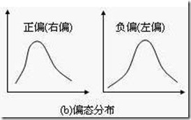

# 11-使用可视化探索数据

使用下面的notebook 对你新结合的数据帧执行探索性数据分析。创建一些可视效果来回答notebook 下面的这些练习问题。

- 根据此数据集中的列的直方图，以下哪个特征变量显示为右偏态？*固定酸度、总二氧化硫、pH 值、酒精度*
- 根据质量对不同特征变量的散点图，以下哪个最有可能对质量产生积极的影响？_挥发性酸度、残糖、pH 值、酒精度

notebook 文件名：用可视化工具进行探索性数据分析

## 关于右偏态

频数分布有正态分布和偏态分布之分。正态分布是指多数频数集中在中央位置，两端的频数分布大致对称。

**偏态分布**是指频数分布不对称，集中位置偏向一侧。若集中位置偏向数值小的一侧，称为**正偏态分布**；集中位置偏向数值大的一侧，称为**负偏态分布**。

如果频数分布的高峰向左偏移，长尾向右侧延伸称为**正偏态分布**，也称**右偏态分布**；同样的，如果频数分布的高峰向右偏移，长尾向左延伸则成为**负偏态分布**，也称**左偏态分布**。

**峰左移，右偏，正偏**

**峰右移，左偏，负偏**

偏态分布只有满足一定的条件（如样本例数够大等）才可以看做近似正态分布。

与正态分布相对而言，偏态分布有两个**特点**：

一是左右不对称（即所谓偏态）；

二是当样本增大时，其均数趋向正态分布。

### 习题 1/2

根据这个数据集中的列的直方图，哪个特征变量出现右偏态？

- [x] 固定酸度
- [ ] 总二氧化硫
- [ ] pH 值
- [x] 酒精度

 

通过可视化，我们可以直观的看出**固定酸度和酒精度**出现右偏态。

### 习题 2/2

根据质量对不同特征变量的散点图，以下哪个最有可能对质量产生积极的影响？

- [ ] 挥发性酸度
- [ ] 残糖
- [ ] pH 值
- [x] 酒精度

通过散点图，我们知道酒精度可能对质量产生积极的影响。