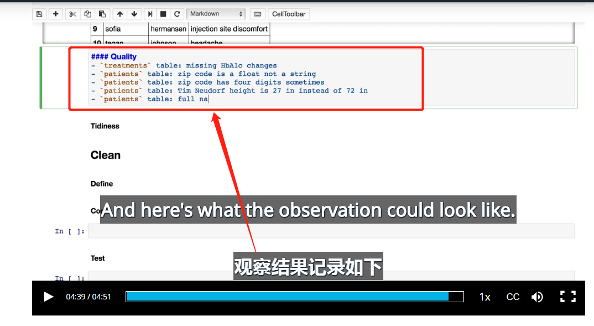

# 5_评估数据

- 通过大致观察评估数据，找出数据的错误类型，记录在markdown 中。
- 通过目测评估每列数据发现数据质量问题，前面可以写对应的表格名。

### Quatity 数据质量问题

- treaments: missing HbA1c changes, HbA1c changes列存在缺失值
- patients table : zip_code is float not a string. 意思是：是字符型，有四位数字的邮编
- patients table : zip_code has four digits sometimes ,有四位数字的邮编,美国邮编应该是5位

